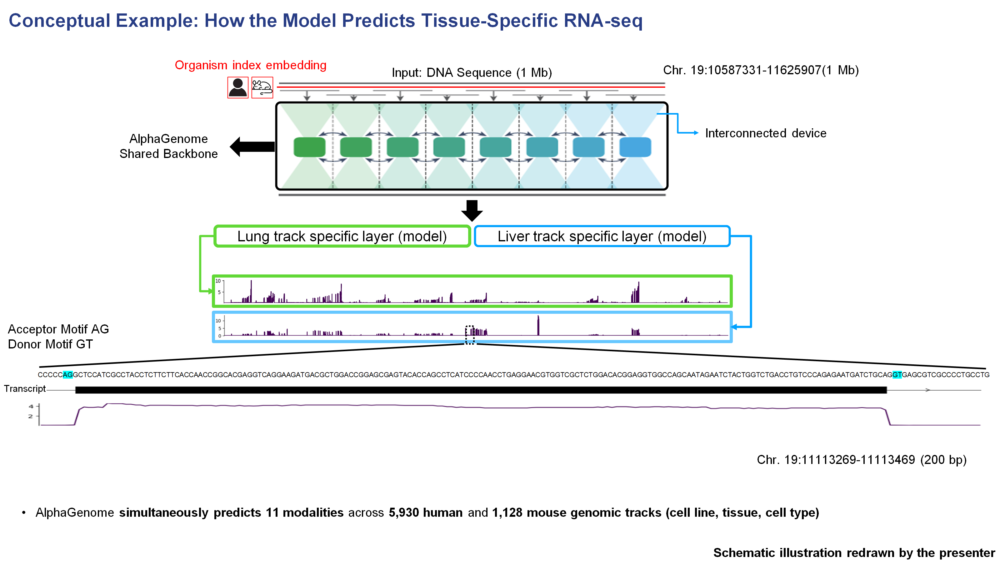
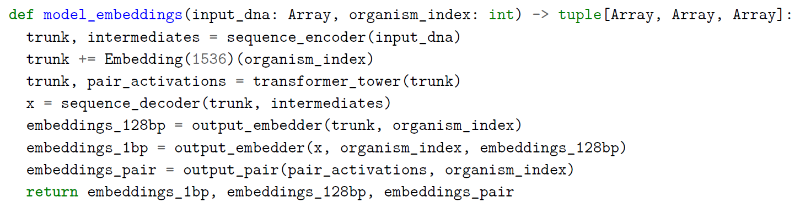

# Figure 1 Panel A Supplementary Notes

{ .figure-wide }

이 도식은 원논문의 원본 figure가 아니라, **제가 AlphaGenome API access를 신청해 실제 genomic interval에 대해 inference를 수행한 뒤**, 그 결과를 바탕으로 발표용으로 다시 그린 **conceptual example**입니다. 즉, AlphaGenome이 동일한 DNA 서열에 대해 조직별 RNA-seq track을 어떻게 다르게 예측하는지를 직관적으로 설명하기 위해, 실제 예측 결과를 토대로 재구성한 보조 그림이라고 보시면 됩니다.

가장 위를 보면 약 **1 Mb 길이의 DNA 서열**이 입력으로 들어갑니다. 이때 입력에는 단순한 염기서열만 들어가는 것이 아니라, 해당 서열이 **human인지 mouse인지** 를 구분하기 위한 **species identity input**도 함께 들어갑니다. 논문 Figure 1 caption에서도 AlphaGenome은 **1 Mb DNA sequence**와 **species identity (human/mouse)를 입력으로 받아 (*아래 설명 참고)**, 사람에서는 5,930개, 마우스에서는 1,128개의 genome track을 예측한다고 설명합니다.

??? note "Supplementary explanation: organism index embedding"

    { .figure-wide }

    

    <b>AI/engineering tip.</b> 
    여기서 organism index embedding은 human / mouse 같은 <b>범주형 species 정보</b>를 학습 가능한 벡터로 바꿔 backbone 계산에 조건(condition)으로 넣는 방식이라고 이해하면 됩니다.  

    코드상으로는 이 species embedding이 raw DNA sequence에 바로 붙는 것이 아니라, 먼저 <b>sequence encoder</b>가 만든 hidden representation(<code>trunk</code>)에 더해진 뒤 그 상태로 <b>transformer tower</b>에 입력됩니다. 즉, 모델은 transformer 단계부터 이미 “지금 처리 중인 입력이 human인지 mouse인지”를 알고 있는 상태에서 long-range context를 통합하게 됩니다.  

    또 pseudocode를 보면 organism index는 transformer 앞에서 한 번만 쓰이는 것이 아니라, 그 이후 <b>output_embedder</b>와 <b>output_pair</b>에서도 다시 사용됩니다. 즉, species 정보는 backbone representation을 조건화할 뿐 아니라, 최종 output head 쪽에서도 human / mouse에 맞는 출력 공간을 선택하는 데 함께 관여한다고 볼 수 있습니다.  

    참고로 여기서 <b>1 Mb</b>는 입력 서열 길이이고, species embedding 자체의 차원은 pseudocode 기준으로 <b>1536-dimensional vector</b>에 해당합니다. 직관적으로는 이 1536차원 species embedding이 각 sequence position의 hidden state에 broadcast되어 더해진다고 이해하면 됩니다.
    

여기서 중요한 점은, 이렇게 긴 1 Mb 서열이 **GPU 하나에서 단순히 한 번에 처리되는 것이 아니라**, 그림의 “interconnected devices”가 시사하듯이 **여러 device에 나뉘어 분산 처리된다는 점**입니다. 논문 본문에서는 base-pair-resolution training을 위해 **sequence parallelism across eight interconnected TPU v3 devices** 를 사용했다고 설명하고, Figure 1 caption에서는 1 Mb 입력을 **131-kb chunks** 로 나누어 여러 device에 걸쳐 처리한다고 적고 있습니다. 

즉, 계산 관점에서 보면 이것은 단순한 data parallelism이라기보다, **하나의 긴 sequence 자체를 여러 장치가 나누어 맡아 처리하는 방식**에 더 가깝습니다. 각 장치는 자기에게 할당된 구간의 representation을 계산하고, 중간의 transformer 단계에서 서로 정보를 교환하면서 장거리 genomic context를 통합합니다. 이런 구조가 필요한 이유는 1 Mb 길이의 입력과 수천 개의 output track을 한 번에 다루기 위해서는 메모리와 계산량이 매우 크기 때문입니다. AlphaGenome은 U-Net-inspired backbone 위에서 encoder–transformer–decoder 구조로 local pattern과 long-range dependency를 함께 처리하도록 설계되어 있습니다. 

그 다음에는 공통적인 **shared backbone**을 통해 학습된 서열 표현이 각 **task / track-specific output layer**로 전달됩니다. 이 그림에서는 예시로 **lung RNA-seq track**과 **liver RNA-seq track** 두 개를 따로 그려 두었습니다. 즉, 입력 DNA 서열 자체는 완전히 같더라도, 어느 조직의 어떤 track을 읽어내느냐에 따라 서로 다른 output head를 거쳐 최종 예측 신호가 달라지게 됩니다. 논문에서도 AlphaGenome은 공통 backbone 위에서 다양한 세포 유형과 조직에 걸친 수천 개의 track을 동시에 예측한다고 설명합니다. 

이것이 가능한 이유는 AlphaGenome이 하나의 공통 backbone 위에 사람에서는 약 **5,930개**, 마우스에서는 약 **1,128개**의 track-specific output head를 두고 있기 때문입니다. 즉, backbone은 서열에서 공통적인 규칙을 학습하고, 각 output head는 특정 조직·세포유형·세포주에 맞는 functional signal을 개별적으로 읽어내는 역할을 합니다. 그래서 동일한 genomic region이라도 lung에서는 강하게 예측되고, liver에서는 약하게 예측되는 식의 **tissue-specific output**이 가능해집니다. 

또 이 보조 그림은 완전히 임의의 locus를 쓴 것이 아니라, 논문 **Figure 2** 에서 track prediction example로 사용한 **chr. 19의 held-out region / HepG2 설정**과 연결되는 예시로 이해하면 좋습니다. 논문 Figure 2a는 **human chr. 19:10587331–11635907 (1 Mb)** 구간의 observed vs predicted track을 보여주고, Figure 2b는 그 안의 **LDLR 주변 50 kb 구간 (chr. 19:11086619–11136619)** 을 확대해 splicing과 RNA-seq 예측을 보여줍니다. 즉, 지금 그린 supplementary schematic은 “Figure 1의 architecture가 실제로 Figure 2의 chr19 예시에서 어떻게 output으로 이어지는가”를 직관적으로 설명하기 위한 bridge figure라고 이해하면 자연스럽습니다. 여기서는 Lung과 Liver를 활용하였는데, HepG2 RNA-seq 그림과 비교해보셔도 좋을 것 같습니다.

아래 확대된 예시를 보면, 예측된 RNA-seq signal이 DNA sequence 및 transcript 구조와 어느 정도 대응하는 것도 확인할 수 있습니다. LDLR 유전자의 두 번째 exon영역 200bp 구간을 확대해 보았을 때, 특히 exon 구간에서 RNA expression signal이 상대적으로 높게 나타나고, splice donor motif인 **GT**, acceptor motif인 **AG** 주변과 transcript 구조가 예측 신호와 맞물려 있다는 점을 시각적으로 확인할 수 있습니다. 즉, 모델은 단순히 “이 유전자가 발현된다” 수준만 예측하는 것이 아니라, 서열 구조와 전사체 구조에 맞는 RNA-seq coverage pattern까지 어느 정도 학습하고 있음을 보여줍니다. 이 점은 논문 Figure 2b에서도 LDLR 주변에서 base-pair-resolution RNA-seq, splice donor/acceptor, splice site usage, splice junction 예측을 함께 제시한 것과 일관됩니다.

정리하면, 이 보조 그림의 핵심은 다음과 같습니다. AlphaGenome은 **하나의 1 Mb DNA 서열**을 입력으로 받아, species identity를 함께 조건으로 넣고, 이를 **여러 TPU device에 sequence-parallel하게 분산 처리**해 장거리 문맥을 통합한 뒤, 공통 backbone 위에 얹힌 **track-specific output head**를 통해 조직별 RNA-seq 예측을 생성합니다. 따라서 **같은 DNA 서열이라도 어떤 조직의 어떤 track을 읽느냐에 따라 서로 다른 RNA-seq output이 나타날 수 있으며**, 이것이 바로 AlphaGenome이 tissue-specific functional genomics prediction을 수행하는 기본 원리입니다. 

<b>Takeaway.</b>  
This supplementary schematic was redrawn from an actual AlphaGenome API inference and highlights a core engineering idea of the model:  
the same 1 Mb DNA sequence is conditioned on species identity, processed with sequence parallelism across interconnected TPU devices, and then decoded into tissue-specific outputs through track-specific heads. 

