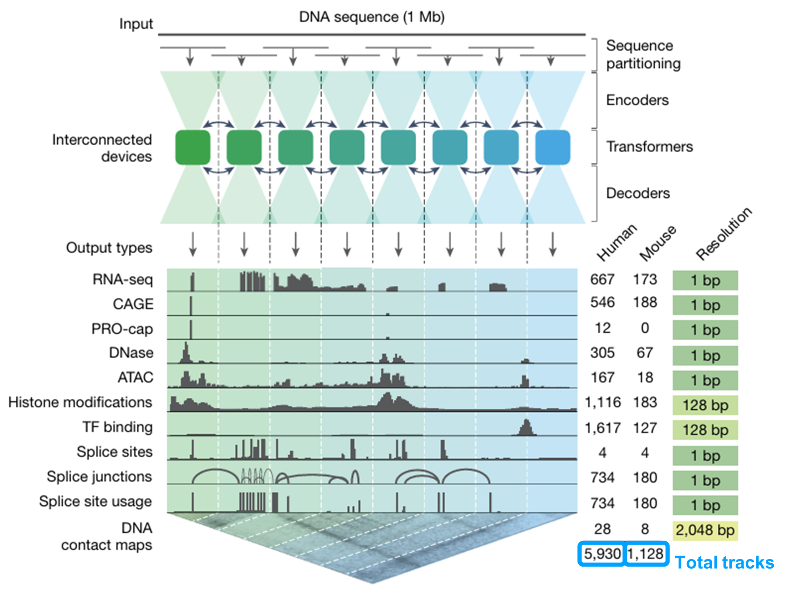
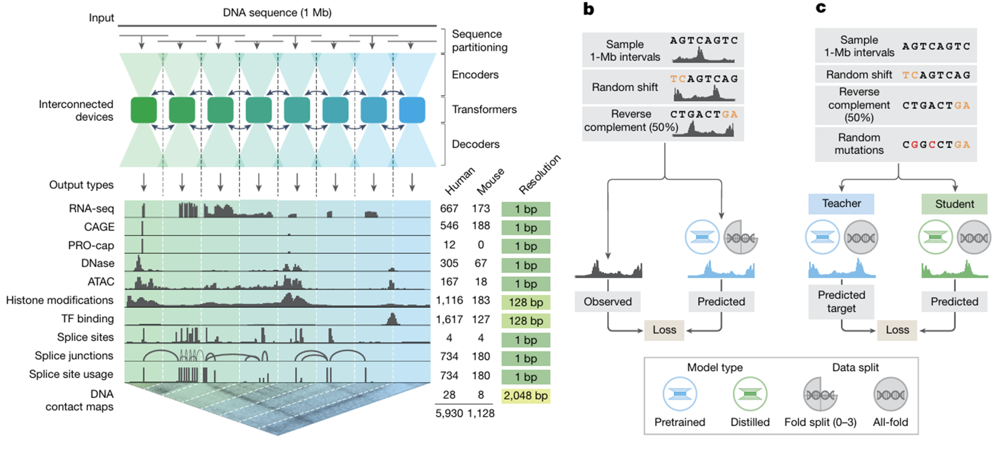
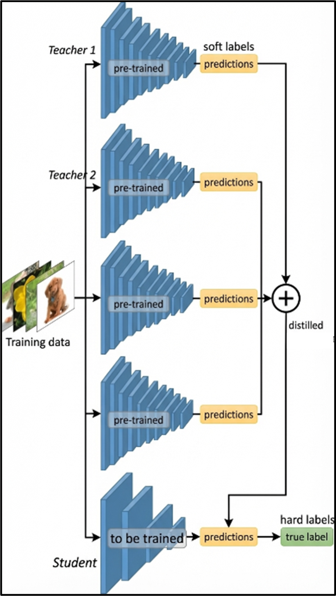
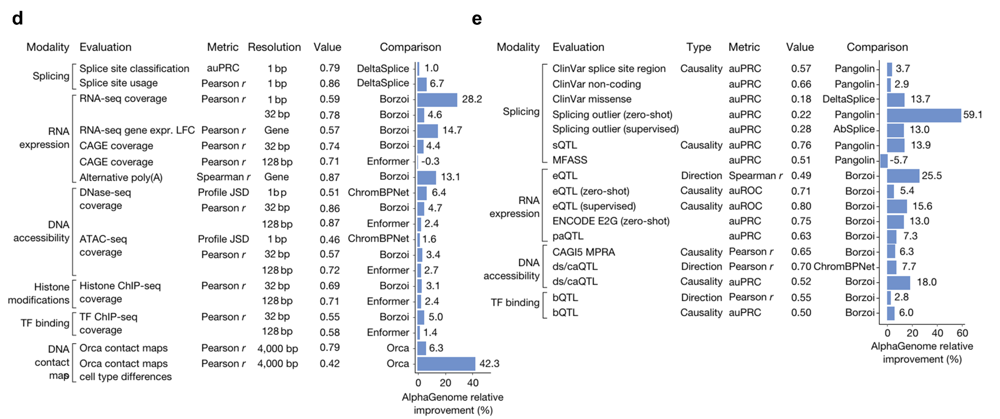

# Figure 1. Model overview, training, and global benchmarks

## Panel A — AlphaGenome의 전체 아키텍처와 예측 대상

{ .figure-wide }

Figure 1A. 약 1 Mb 입력, encoder–transformer–decoder backbone, 그리고 modality별 해상도와 track 수를 요약합니다.

가장 먼저 패널 A에서는 AlphaGenome의 전체 아키텍처와 예측 대상이 요약되어 있습니다.  
이 모델은 약 **1 Mb**, 즉 약 백만 개 길이의 DNA 서열을 입력으로 받습니다.  
그리고 이 긴 입력 서열을 **encoder, transformer, decoder**를 거쳐 처리한 뒤, 아래에 제시된 여러 functional genomics modality를 동시에 예측합니다.

중요한 점은 이 모델이 단일 output만 예측하는 것이 아니라,  
RNA-seq, CAGE, DNase, ATAC, histone modification, TF binding, splice site, splice junction, contact map까지  
**총 11가지 modality와 매우 많은 track을 한 번에 예측한다는 점**입니다.

예를 들어 RNA-seq의 경우 1 bp 단위로 사람에서는 **667개**, 마우스에서는 **173개**의 track을 동시에 예측합니다.  
여기서 말하는 track은 brain, blood, cell line 같은 **조직·세포 유형·세포주별 출력 채널**이라고 이해하면 됩니다.

또 출력 해상도는 task에 따라 다르게 설정됩니다.  
대부분의 RNA 관련 task는 1 bp 수준으로 예측하고, histone modification이나 TF binding 같은 task는 **128 bp**로 설정합니다.  
DNA contact map은 더 거친 **2,048 bp** 해상도를 사용합니다.

핵심은 AlphaGenome이 **1 Mb의 긴 DNA 문맥**을 입력으로 받아  
여러 modality와 방대한 track을 하나의 framework 안에서 동시에 예측하면서도,  
각 task의 특성에 맞게 출력 해상도를 다르게 설계했다는 점입니다.

## Panel B–C — 학습 데이터 증강, fold split, distillation

{ .figure-wide }

Figure 1B–C. 데이터 증강, fold split, 그리고 teacher → student distillation의 전체 흐름입니다.

다음으로 패널 B에서는 모델이 어떻게 학습되는지를 보여줍니다.  
여기서 **sample 1-Mb intervals**는 실제 학습에 들어가는 입력 DNA 구간을 뜻합니다.

학습 과정에서는 두 가지 데이터 증강을 사용합니다.

1. **Random shift**  
   입력 DNA 서열과 그에 대응하는 출력 track을 함께 조금씩 이동시켜,  
   모델이 특정 절대 좌표에 과도하게 의존하지 않도록 합니다.

2. **Reverse complement augmentation**  
   50% 확률로 reverse complement를 적용해서,  
   DNA가 double-stranded molecule이라는 점을 반영하고 한 방향 representation에만 치우치지 않도록 합니다.

학습 자체는 **fold split** 방식으로 진행됩니다.  
유전체를 여러 fold로 나누고, 특정 fold는 평가에만 사용하고 나머지 fold로 학습하는 식입니다.  
즉, 어떤 구간을 평가에 썼다면 그 구간은 학습에 다시 넣지 않고, 이 과정을 반복해서 여러 개의 teacher model을 얻게 됩니다.

그 다음 패널 C에서는 이렇게 얻은 여러 teacher model을 실제 배포 가능한 하나의 student model로 압축합니다.  
teacher를 그대로 앙상블하면 계산 비용이 너무 크기 때문에,  
저자들은 **knowledge distillation**을 통해 단일 student가 teacher ensemble의 예측 패턴을 따라 배우도록 합니다.

{ .figure-small }

Distillation 상세 도식. 여러 teacher의 soft label을 student가 모방하고, 동시에 hard label도 함께 사용합니다.

여기서 student는 정답 데이터만 직접 배우는 것이 아니라,  
여러 teacher model이 만들어낸 **soft label**까지 함께 학습합니다.  
또 distillation 단계에서는 random mutations를 섞어서,  
서열이 조금 바뀌었을 때 teacher가 어떻게 반응하는지도 함께 모방하게 만듭니다.

이 전략은 단순히 모델을 작게 만드는 것뿐 아니라,  
**variant effect 예측까지 더 robust하게 만들기 위한 장치**라고 볼 수 있습니다.

## Panel D–E — 전반적인 benchmark 성능

{ .figure-wide }

Figure 1D는 genome track prediction, Figure 1E는 variant effect prediction benchmark를 요약합니다.

패널 D는 fold-split 모델을 이용해서 전반적인 **genome track prediction 성능**을 평가한 결과입니다.  
표의 왼쪽에는 어떤 modality와 task를 평가했는지, metric이 무엇인지, 그리고 어떤 resolution에서 평가했는지가 나와 있습니다.  
여기서 **value**는 AlphaGenome 자체의 절대 성능이고, 오른쪽 **comparison**은 기존 최고 모델 대비 얼마나 향상되었는지를 의미합니다.

핵심은 대부분의 genome track prediction task에서 AlphaGenome이 기존 모델보다 더 좋은 성능을 보였다는 점입니다.  
논문 요약 기준으로는 **24개 task 중 22개**에서 SOTA를 달성했다고 정리할 수 있습니다.

패널 E는 **variant effect prediction** 결과입니다.  
즉, 변이가 생겼을 때 발현량, splicing, accessibility, TF binding 같은 출력이 어떻게 달라지는지를 예측하는 task입니다.  
여기서 direction은 증가·감소의 방향을 맞추는 것이고, correlation은 변화의 크기까지 포함한 연속적인 패턴을 얼마나 잘 맞추는지를 보는 지표로 이해하면 됩니다.

이 variant effect prediction에서도 AlphaGenome은 대부분의 benchmark에서 기존 모델보다 더 좋은 성능을 보였고,  
논문 요약 기준으로는 **26개 task 중 25개**에서 최고 성능을 기록했습니다.

Figure 1 전체의 메시지는 명확합니다.  
AlphaGenome은 다양한 modality를 동시에 다루는 **generalist model**이면서도,  
단순한 genome track prediction뿐 아니라 **variant effect prediction에서도 매우 강한 성능**을 보입니다.

