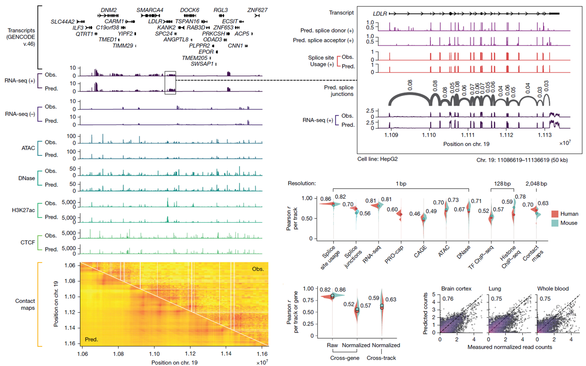
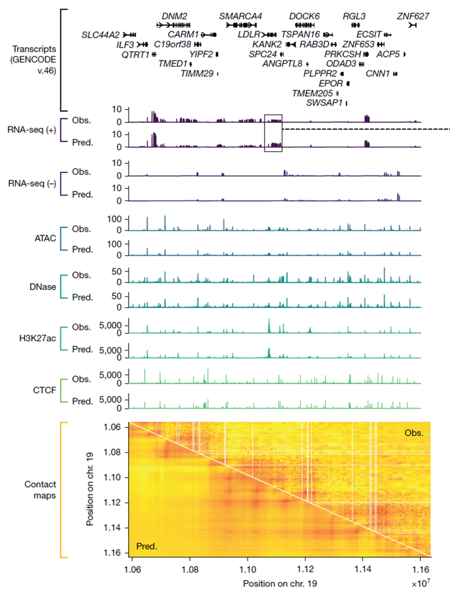
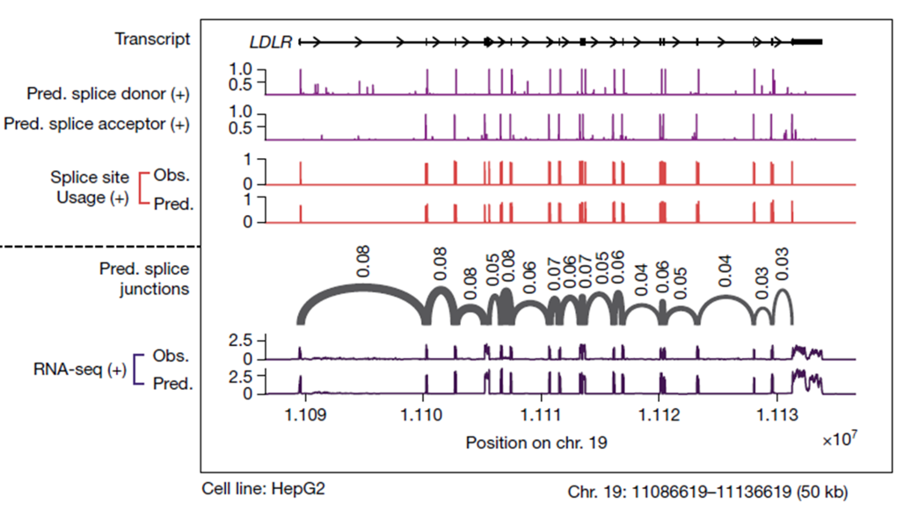
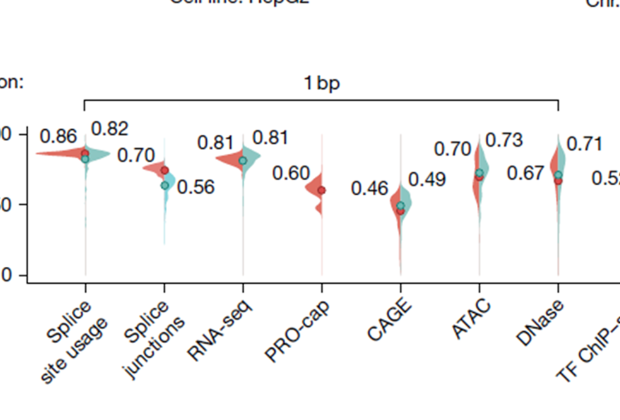
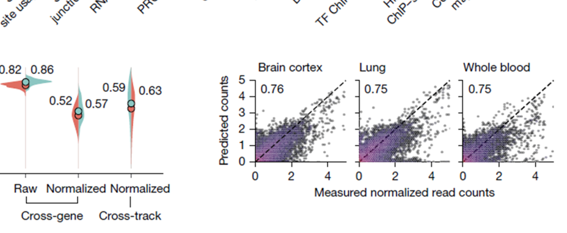

# Figure 2. Qualitative and quantitative prediction examples

## Figure 2 전체 보기

{ .figure-wide }

Figure 2는 정성적 예측 예시와 정량적 correlation 결과를 함께 보여줍니다.

Figure 2는 AlphaGenome이 단순히 거친 발현 패턴만 맞추는 것이 아니라,  
RNA-seq, splice site usage, splice junction, accessibility, contact map 같은 정교한 readout까지  
얼마나 잘 예측하는지를 정성적·정량적으로 보여주는 figure입니다.

## Panel A — 1 Mb 구간에서의 multi-modal track prediction

{ .figure-medium }

Chr19의 특정 1 Mb 구간에서 observed와 predicted track을 나란히 비교한 예시입니다.

패널 A에서는 염색체 19번의 특정 위치에서 약 **1 Mb 길이의 DNA 서열**을 입력으로 넣고,  
출력 track은 **HepG2** cell line으로 설정했을 때의 예측 결과를 시각화했습니다.

각 그래프는 위쪽의 **observed**와 아래쪽의 **predicted**로 나뉘어 있습니다.  
observed는 실제 실험에서 얻어진 값이고, predicted는 AlphaGenome이 예측한 값입니다.  
육안으로 보더라도 전반적인 패턴이 실제 값과 꽤 유사하게 맞아떨어집니다.

즉, 모델이 단순히 일부 peak만 맞추는 것이 아니라  
RNA-seq, ATAC, DNase, histone mark, contact map 등 여러 modality의 구조를 함께 재현하고 있다는 점이 중요합니다.

## Panel B — 50 kb 확대: LDLR 주변 splice-related readout

{ .figure-medium }

LDLR 유전자 주변을 50 kb 정도 확대해서 donor/acceptor, splice site usage, splice junction을 보여줍니다.

패널 B에서는 패널 A의 일부 구간을 약 **50 kb** 정도 확대해서 보여줍니다.  
여기서는 LDLR 유전자 주변을 예시로 들고 있습니다.

먼저 splice donor와 acceptor 예측을 보면, 이 신호들이 transcript 구조, 특히 **exon 경계와 잘 맞아떨어지는 것**을 볼 수 있습니다.  
즉, 모델이 단순히 발현량만 맞추는 것이 아니라, 스플라이싱과 관련된 구조적 정보까지 비교적 정밀하게 포착하고 있다는 뜻입니다.

그 아래의 **splice site usage**는 각 splice site가 실제로 얼마나 자주 사용될지를 single-base 수준에서 정량적으로 예측한 값입니다.  
donor/acceptor가 “여기가 splice site인가”를 묻는 분류 문제라면,  
splice site usage는 “그 splice site가 실제로 얼마나 사용되는가”를 묻는 양적 예측에 가깝습니다.

그리고 **splice junction**은 한 단계 더 나아가서,  
어떤 exon과 exon이 실제로 얼마나 자주 연결되는지를 예측합니다.  
즉, 특정 site 하나의 성질만 보는 것이 아니라 **junction 수준의 연결 패턴**까지 예측한다는 뜻입니다.

## Panel C — modality별 track correlation 분포

{ .figure-small }

여러 modality에서 observed와 predicted의 Pearson correlation 분포를 요약한 바이올린 플롯입니다.

패널 C에서는 전반적인 예측 성능을 다양한 modality에 대해 정량적으로 보여줍니다.  
각 바이올린은 여러 track에서 계산된 **Pearson correlation coefficient**의 분포를 나타냅니다.  
즉, human과 mouse 각각에 대해, 각 modality에서 observed와 predicted가 얼마나 잘 일치하는지를 요약한 그림이라고 볼 수 있습니다.

이 그림은 “어떤 한두 개 예시만 잘 맞은 것 아닌가”라는 질문에 대한 답으로,  
전반적인 track 수준에서도 예측이 안정적이라는 점을 보여줍니다.

## Panel D–E — expression과 splice junction의 정량 평가

{ .figure-medium }

raw expression, normalized expression, 그리고 splice junction-level quantitative signal에 대한 정량 평가입니다.

패널 D에서는 RNA-seq 예측 성능을 조금 더 구체적으로 나눠서 보여줍니다.  
여기서는 단순한 **raw expression**과 **quantile-normalized expression**을 구분해서 평가합니다.

raw expression에서는 어떤 유전자가 원래 전반적으로 많이 발현되는지, 거의 발현되지 않는지를 보는 경향이 강하기 때문에  
상관계수가 비교적 높게 나오는 편입니다.  
반면 normalized expression 평가는 baseline expression 차이를 어느 정도 제거한 뒤,  
특정 유전자가 특정 조직에서만 유난히 올라가거나 내려가는 **cell-type-specific deviation**을 얼마나 잘 맞추는지를 평가하므로 더 어렵습니다.

패널 E는 splice junction readout 예측 결과입니다.  
단순히 RNA-seq coverage를 대략 비슷하게 맞추는 수준이 아니라,  
보다 어려운 **junction-level quantitative signal**도 대규모로 잘 예측하고 있다는 점을 보여줍니다.

Figure 2의 메시지는, AlphaGenome이 단순한 coverage 모델이 아니라  
RNA-seq, splice site usage, splice junction처럼 더 정교한 분자적 readout까지 비교적 정확하게 예측할 수 있다는 것입니다.

