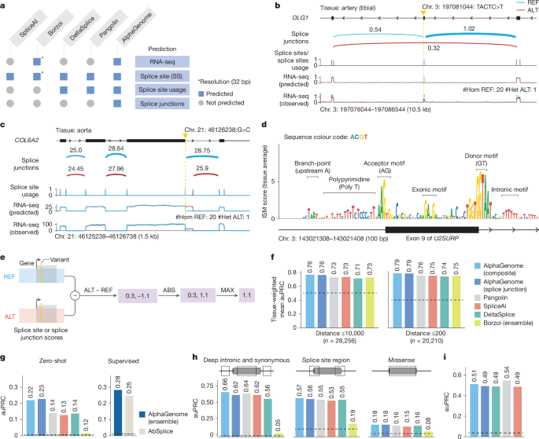
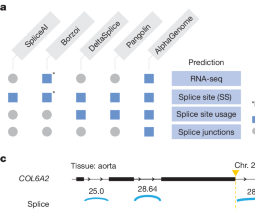
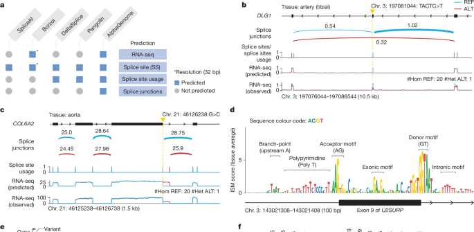
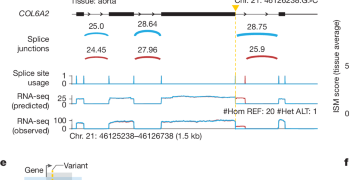
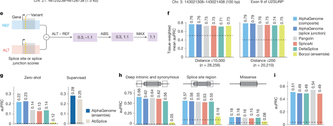

# Figure 3. Splicing variant effect prediction

Figure 3는 AlphaGenome의 **splicing variant effect prediction**을 세 층위에서 보여줍니다. 먼저 모델이 어떤 splicing readout을 예측하는지 정의하고, 그다음 실제 변이 예시에서 exon skipping과 새로운 splice junction 형성을 정성적으로 재현하는지를 보여주며, 마지막으로 여러 benchmark에서 이 예측을 variant scorer로 바꾸었을 때 얼마나 잘 작동하는지를 정량적으로 검증합니다.

## Figure 3 전체 보기

{ .figure-wide }

이 figure의 흐름은 비교적 명확합니다.  
**패널 A**는 “AlphaGenome이 기존 모델보다 무엇을 더 예측하느냐”를 정의하는 부분이고,  
**패널 B–D**는 “그 예측이 실제 splice-disrupting variant에서 어떻게 보이느냐”를 보여주는 예시이며,  
**패널 E–I**는 “이 예측을 variant effect score로 만들었을 때 benchmark에서 얼마나 잘 통하느냐”를 정량적으로 보여주는 부분입니다.

??? note "Splice site, splice site usage, splice junction은 무엇이 다른가?"

    

    <b>세 수준의 splicing readout.</b> 
    <b>splice site prediction</b>은 각 위치가 donor인지 acceptor인지, 즉 splice site 후보인지를 판단하는 가장 기초적인 수준입니다.  

    <b>splice site usage</b>는 특정 donor 또는 acceptor site가 실제로 얼마나 강하게 사용되는지를 보는 값입니다.  
    즉, <b>개별 site를 통과하는 전체 splice flux의 총량</b>에 가깝습니다.  

    <b>splice junction</b>은 한 단계 더 내려가서, 어떤 donor와 어떤 acceptor가 실제로 연결되는지를 pair 수준에서 봅니다.  
    즉, usage가 “이 site가 전체적으로 얼마나 쓰이느냐”라면, junction은 “그 usage가 구체적으로 어느 상대 site로 분배되느냐”를 보여주는 값입니다.  

    따라서 usage는 <b>site-centric</b>, junction은 <b>pair-centric</b> readout이라고 이해하면 됩니다.
    

## 패널 A — AlphaGenome이 다른 splicing 모델보다 더 넓은 출력을 예측한다

{ .figure-medium }

패널 A의 위쪽 표는 먼저 **비교 모델들이 어떤 출력을 내는지**를 정리합니다.  
SpliceAI는 splice site prediction 중심의 대표적인 specialist model이고,  
Pangolin과 DeltaSplice는 splice site뿐 아니라 splice site usage까지 다루는 계열입니다.  
Borzoi는 RNA-seq을 포함한 더 넓은 multi-task model이지만, 그림에서 보이듯 **splice junction을 직접적인 출력으로 두지는 않습니다.**

여기서 AlphaGenome의 차별점은 단순히 splice donor/acceptor만 찾는 데서 끝나지 않고,  
**splice site usage와 splice junction까지 함께 예측한다는 점**입니다.  
즉, “어디가 splice site인가”를 넘어서,  
“그 site가 얼마나 쓰이는가”,  
“실제로 어떤 donor–acceptor 쌍이 연결되는가”까지 한 번에 예측하려는 모델이라는 뜻입니다.

패널 A의 아래 도식은 이 차이를 더 직관적으로 보여줍니다.  
splicing 결과를 이해하려면 개별 site의 존재 여부만으로는 충분하지 않고,  
**site 간 경쟁, 상대적 사용량, 그리고 최종 exon–exon 연결 구조**까지 봐야 합니다.  
AlphaGenome은 바로 이 더 구조적인 수준까지 모델링한다는 점에서,  
splicing variant effect를 해석할 때 더 풍부한 정보를 제공할 수 있습니다.

## 패널 B–D — 실제 splice-disrupting variant 예시와 ISM 해석

{ .figure-wide }

패널 B–D는 AlphaGenome이 실제 변이에서 어떤 splicing 결과를 예측하는지를 보여주는 부분입니다.  
이 부분의 핵심은 모델이 단순히 RNA-seq coverage의 높낮이만 바꾸는 것이 아니라,  
**splice junction, splice site usage, RNA coverage가 서로 정합적인 방식으로 함께 바뀌는지**를 보는 것입니다.

### 패널 B — DLG1에서 exon skipping을 유발하는 4-bp deletion

패널 B는 GTEx artery tibial tissue에서 관찰된 **DLG1 exon skipping variant** 예시입니다.  
REF는 파란색, ALT는 빨간색으로 표시되어 있고,  
위에서부터 predicted splice junction, splice site usage, predicted RNA-seq, observed RNA-seq가 배치되어 있습니다.

이 패널에서 먼저 봐야 할 것은 **ALT에서 특정 exon을 가로지르는 junction pattern이 달라진다**는 점입니다.  
그 변화는 단순한 junction 한 줄의 변화로 끝나지 않고,  
해당 exon의 **splice site usage 감소**,  
그리고 실제로 그 exon 부위의 **RNA-seq coverage 감소**와 함께 나타납니다.  
즉, AlphaGenome은 “이 변이가 splicing에 영향이 있다” 정도만 말하는 것이 아니라,  
**어떤 exon이 skip되고 그 결과 coverage가 어떻게 바뀌는지까지 구조적으로 연결된 예측**을 내고 있습니다.

### 패널 C — COL6A2에서 새로운 splice donor 형성과 기존 donor 교란

패널 C는 aorta에서 관찰된 **COL6A2 locus** 예시입니다.  
이 경우 변이는 기존 splice donor를 흔드는 동시에 **새로운 splice donor를 만드는 방향**으로 작동합니다.  
그래서 그림을 보면 donor/usage/junction/RNA-seq 변화가 한쪽으로만 줄어드는 형태가 아니라,  
**기존 연결이 깨지면서 새로운 연결이 생기는 재배선(rewiring)** 형태로 나타납니다.

{ .figure-medium }

가까이서 보면 중요한 포인트가 더 잘 보입니다.  
모델은 변이 주변에서 **새 donor가 생길 위치**,  
기존 donor의 사용이 약해질 위치,  
그리고 그 결과 RNA coverage가 재분배되는 방향을 함께 포착합니다.  
즉, 이 패널은 AlphaGenome이 단순한 “loss of splicing”뿐 아니라  
**alternative splice choice의 재구성**까지 예측할 수 있음을 보여줍니다.

### 패널 D — ISM이 보여주는 splicing grammar

패널 D는 U2SURP exon 9와 양쪽 intron에 대해 수행한 **ISM (in silico mutagenesis)** 결과입니다.  
여기서는 각 위치의 염기를 하나씩 바꾸었을 때, 평균 splice junction score가 얼마나 변하는지를 계산합니다.  
그래프 위에 표시된 motif를 보면 branch point, polypyrimidine tract, acceptor motif, donor motif뿐 아니라 exon/intron 내부 motif까지 반응이 나타납니다.

이 패널의 의미는 꽤 큽니다.  
모델이 splice site 근처의 canonical motif만 얕게 외운 것이 아니라,  
**실제 splicing machinery가 민감해하는 sequence grammar 전체에 반응하고 있다**는 해석이 가능하기 때문입니다.  
즉, AlphaGenome의 splicing prediction은 단순 상관 예측이 아니라  
어느 정도는 **sequence determinant 수준의 구조적 학습**을 반영하고 있다는 뜻입니다.

??? note "왜 패널 B–D가 중요한가?"

    

    <b>이 부분은 benchmark보다 먼저 보여주는 qualitative sanity check입니다.</b> 
    패널 B와 C는 실제 variant가 exon skipping 또는 새로운 junction 형성을 유도할 때,  
    AlphaGenome의 예측이 splice junction, site usage, RNA-seq coverage 사이에서 서로 일관되게 바뀌는지를 보여줍니다.  

    패널 D는 그 예측이 어떤 sequence motif에 의해 구동되는지 해석 가능한지를 보여줍니다.  
    즉, Figure 3의 앞부분은 “이 모델이 무엇을 예측하느냐”와 “그 예측이 생물학적으로 그럴듯하냐”를 먼저 확인하는 역할을 합니다.
    

## 패널 E–I — variant score 정의와 benchmark

{ .figure-wide }

Figure 3의 뒤쪽은 AlphaGenome의 splicing-related 예측을 실제 **variant scorer**로 바꿨을 때 얼마나 잘 작동하는지를 정량적으로 검증하는 부분입니다.

### 패널 E — splice variant effect score는 REF–ALT 차이의 최대 변화량으로 정의한다

패널 E에서는 splicing variant effect score를 어떻게 정의했는지를 보여줍니다.  
기본 아이디어는 간단합니다. 같은 locus에 대해 **REF sequence와 ALT sequence를 각각 모델에 넣고**,  
splice site 또는 splice junction prediction이 얼마나 달라지는지를 계산합니다.  
그중 가장 크게 변한 값을 그 변이의 effect score로 사용합니다.

여기서 중요한 점은 **Figure 3에서는 방향보다 크기가 중요하다**는 것입니다.  
expression에서는 ALT가 올리는지 내리는지가 중요하지만,  
splicing에서는 “정상적인 연결 구조를 얼마나 깨뜨리느냐”가 핵심이기 때문에  
논문은 **절대값 기반의 변화량**으로 score를 정의합니다.  
즉, donor가 약해지든 새로운 donor가 생기든,  
중요한 것은 그 변이가 **splicing graph를 얼마나 크게 흔드느냐**입니다.

### 패널 F — fine-mapped sQTL benchmark

패널 F는 fine-mapped **sQTL**을 이용한 causality classification benchmark입니다.  
여기서 비교 대상은 true causal sQTL variant와 그 주변의 non-causal nearby variant입니다.  
논문은 Borzoi와 동일한 방식으로,  
가장 가까운 splice site 기준 **10,000 bp window**와 **200 bp window** 두 설정을 나누어 평가합니다.

이 그림에서 중요한 포인트는 두 가지입니다.  
첫째, AlphaGenome의 **composite scorer**가 두 설정 모두에서 가장 높은 성능을 보인다는 점입니다.  
둘째, **splice junction-only scorer만 따로 떼어 놓아도 기존 방법들과 매우 경쟁력 있거나 더 높은 성능**을 낸다는 점입니다.

이건 의미가 분명합니다.  
splicing variant를 평가할 때 donor/acceptor 존재 여부만 보는 것보다,  
**실제로 어떤 exon–exon 연결이 깨지고 생기는지를 직접 모델링하는 정보가 훨씬 유용하다**는 뜻이기 때문입니다.  
특히 200 bp window는 positive 주변의 매우 비슷한 negative variant와 구분해야 하므로 더 어려운 설정인데,  
그 안에서도 AlphaGenome이 우세하다는 점이 중요합니다.

### 패널 G — rare splicing outlier variant prediction

패널 G는 GTEx에서 **splicing outlier**와 연관된 rare variant를 예측하는 benchmark입니다.  
여기서는 **zero-shot**과 **supervised** 두 설정이 따로 나옵니다.

zero-shot은 말 그대로 이 task를 위해 별도 classifier를 학습하지 않고,  
AlphaGenome의 variant score 자체만으로 rare splice-disrupting variant를 구분하는 설정입니다.  
supervised는 AbSplice와 유사한 방식으로 별도 ensemble model을 얹은 설정입니다.  
즉, zero-shot은 모델 자체의 본래 표현력, supervised는 그 표현을 downstream classifier가 얼마나 잘 활용하는지를 본다고 이해하면 됩니다.

이 패널에서 AlphaGenome은 두 설정 모두에서 강한 성능을 보입니다.  
즉, **task-specific training 없이도 이미 유용한 splicing signal을 내고 있고**,  
추가 학습을 붙였을 때도 그 signal이 downstream에서 잘 살아남는다는 뜻입니다.

### 패널 H — ClinVar pathogenic vs benign classification

패널 H는 ClinVar에서 pathogenic과 benign variant를 구분하는 benchmark입니다.  
그런데 이 패널이 흥미로운 이유는 단순 canonical splice-site variant만 보는 것이 아니라,  
**deep intronic + synonymous**,  
**splice site region**,  
그리고 심지어 **missense 중 AlphaMissense가 likely benign으로 본 변이**까지 포함해서 본다는 점입니다.

즉, 논문은 “splicing score가 정형적인 splice-site mutation에서만 유용한가?”가 아니라,  
**좀 더 넓은 변이 클래스에서도 pathogenicity 정보로 쓸 수 있는가**를 묻고 있습니다.  
결과적으로 AlphaGenome composite score는 각 카테고리에서 강한 성능을 보이며,  
이는 splicing-related effect prediction이 canonical donor/acceptor 근처를 넘어  
더 넓은 disease variant 해석에도 기여할 수 있음을 보여줍니다.

### 패널 I — MFASS benchmark

패널 I는 **MFASS** benchmark입니다.  
이 데이터셋은 massively parallel splicing assay로 실험적으로 splice-disrupting variant를 검증한 매우 까다로운 benchmark입니다.  
Figure 3 전체에서 보면, 이 부분은 AlphaGenome이 **유일하게 기존 최고 specialist model보다 약간 뒤지는 사례**입니다.

이 점은 오히려 중요합니다.  
즉, AlphaGenome은 전반적으로 매우 강하지만,  
모든 splicing benchmark에서 specialist를 완전히 압도하는 것은 아니며,  
특정 assay 또는 특정 task에서는 여전히 dedicated specialist의 강점이 남아 있다는 뜻입니다.  
그래도 Pangolin 다음 수준으로, SpliceAI와 DeltaSplice는 넘는 성능을 보이기 때문에  
multimodal generalist 모델로서는 상당히 강한 결과라고 볼 수 있습니다.

??? note "zero-shot과 supervised는 어떻게 읽어야 하나?"

    

    <b>Zero-shot vs supervised.</b> 
    <b>zero-shot</b>은 해당 benchmark를 위해 별도 classifier를 다시 학습하지 않고,  
    AlphaGenome이 본래 내놓는 variant score만으로 평가하는 설정입니다.  

    <b>supervised</b>는 AlphaGenome score를 feature로 삼아  
    random forest나 ensemble 같은 별도 분류기를 추가로 학습하는 설정입니다.  

    따라서 zero-shot 성능이 좋다는 것은 <b>모델 자체가 이미 좋은 생물학적 신호를 내고 있다</b>는 뜻이고,  
    supervised 성능이 더 좋아진다는 것은 <b>그 신호가 downstream task에서도 잘 활용될 수 있다</b>는 뜻입니다.
    

Figure 3의 핵심은, AlphaGenome이 splicing variant effect를 **splice site, splice site usage, splice junction, RNA-seq**의 여러 층위에서 함께 설명할 수 있고,  
그 가운데서도 특히 **splice junction prediction**이 benchmark 성능 향상에 큰 기여를 한다는 점입니다.

