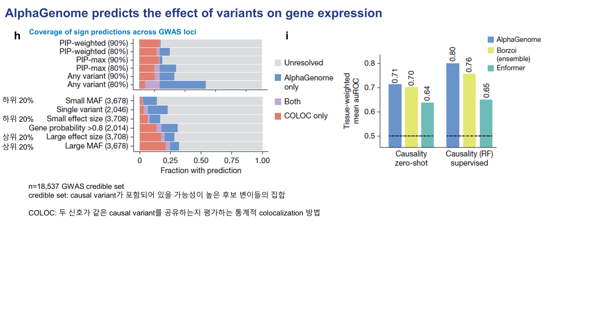

# Figure 4. Predicting the effect of variants on gene expression

## Panels A–G — eQTL direction과 effect size 예측

{ .figure-wide }

Figure 4A–G는 expression effect score 정의, 예시 eQTL, effect-size correlation, sign prediction을 보여줍니다.

Figure 4의 앞부분은 유전 변이가 특정 유전자의 발현을 **올리는지 내리는지**,  
그리고 그 변화의 **크기**를 AlphaGenome이 얼마나 잘 예측할 수 있는지를 보여줍니다.

패널 A에서는 variant effect score를 어떻게 정의했는지를 보여줍니다.  
같은 위치의 서열에 대해 reference allele과 alternative allele을 각각 넣어 RNA-seq signal을 예측한 뒤,  
해당 유전자의 annotated exon 영역에서 평균 signal을 집계합니다.  
그 다음 각 allele의 exon-level signal을 log scale로 변환하고,  
**ALT − REF의 signed log-fold change**를 effect size로 정의합니다.

여기서 Figure 3과 다른 점은, expression에서는 변화의 **방향** 자체가 중요하므로  
절대값을 취하지 않고 **부호를 유지한 score**를 사용한다는 점입니다.

패널 B에서는 colon의 **APOL4** 유전자 주변 eQTL 예시를 보여줍니다.  
실제 observed data에서도 variant가 생겼을 때 RNA-seq signal이 감소하고,  
AlphaGenome의 predicted track에서도 같은 방향의 감소가 나타납니다.  
즉, 모델이 단순히 발현량의 존재 여부만 보는 것이 아니라  
**variant로 인해 발현이 증가하는지 감소하는지 방향까지 잘 포착한다**는 것을 보여줍니다.

오른쪽의 ISM 결과는 관심 variant 주변 약 20 bp 구간에서  
각 염기를 하나씩 바꾸었을 때 RNA-seq가 얼마나 달라지는지를 계산한 것입니다.  
이를 통해 어떤 염기와 어떤 motif가 expression effect에 가장 큰 영향을 주는지를 해석할 수 있습니다.

패널 C와 D는 effect size의 정량 평가입니다.  
정답으로 사용하는 값은 **SuSiE beta posterior**인데,  
이는 실제 사람 데이터에서 해당 변이가 발현을 얼마나 올리거나 내리는지를 fine-mapping 기반으로 추정한 값이라고 보면 됩니다.  
AlphaGenome은 Borzoi나 Enformer보다 더 높은 **Spearman correlation**을 보여줍니다.

패널 E–G는 effect size 전체를 맞추는 대신,  
발현이 증가하는지 감소하는지 **sign만 맞출 수 있는가**를 평가합니다.  
이 평가에서도 AlphaGenome은 전반적으로 더 좋은 성능을 보이며,  
특히 variant가 TSS로부터 더 멀리 떨어진 **distal regulatory variant** 구간에서도  
상대적으로 더 강한 예측력을 유지합니다.

패널 G는 confidence와 recall의 trade-off를 보여줍니다.  
예를 들어 sign accuracy를 약 90% 수준으로 맞추는 조건에서도  
AlphaGenome은 전체 eQTL 중 꽤 큰 비율을 회수합니다.

## Panels H–I — GWAS credible set과 causal variant interpretation

{ .figure-medium }

Figure 4H–I는 GWAS credible set에서의 sign coverage와 causality prediction을 보여줍니다.

패널 H는 GWAS 데이터셋에서 발견된 변이가 실제 trait-associated causal variant인지 얼마나 잘 구분할 수 있는지를 평가합니다.  
여기서 **credible set**은 causal variant가 포함되어 있을 가능성이 높은 후보 변이들의 집합입니다.  
또 **COLOC**은 두 신호가 같은 causal variant를 공유하는지 평가하는 통계적 colocalization 방법입니다.

저자들은 AlphaGenome이 예측한 variant effect를 바탕으로 **PIP-weighted score**를 계산하고,  
이 score를 이용해 disease-associated variant 후보를 선별합니다.  
그 다음 그 변이가 발현을 증가시키는지 감소시키는지, 즉 **sign**을 얼마나 잘 맞추는지를 평가합니다.

이 결과에서 AlphaGenome은 COLOC과 비교해서 더 높은 coverage와 경쟁력 있는 예측을 보이며,  
또 저자들은 두 방법이 완전히 같은 정보를 보는 것이 아니기 때문에  
**sequence-based prediction과 statistical colocalization이 상호보완적**이라고 설명합니다.

패널 I는 한 단계 더 나아가 effect size의 크기까지 맞추는 **causal effect prediction**입니다.  
여기서 zero-shot setting에서는 AlphaGenome이 Borzoi와 비슷하거나 더 나은 수준을 보이고,  
random forest를 이용한 supervised learning을 추가하면  
AlphaGenome feature를 사용한 경우가 더 높은 성능을 냅니다.

즉, AlphaGenome이 만들어내는 variant-level feature 자체가  
기존 모델보다 **정보량이 많고 downstream task에 유용하다**는 의미입니다.

## Panel J — enhancer–gene linking

이번 업로드에는 Figure 4의 **panel J 이미지가 포함되어 있지 않아서** 페이지에는 넣지 않았지만,  
발표 대본 기준으로 보면 이 패널은 AlphaGenome이 enhancer–gene linking task에서도  
zero-shot과 supervised setting 모두에서 경쟁력 있는 성능을 보인다는 점을 설명합니다.

핵심은 다음과 같습니다.

- distance to TSS가 가까운 구간뿐 아니라
- **100–2,500 kb** 같은 장거리 구간에서도
- AlphaGenome feature가 기존 방법보다 더 유용한 signal을 제공할 수 있다는 것

즉, AlphaGenome은 단순한 expression sign prediction을 넘어서  
**enhancer–gene 연결 관계를 설명하는 feature source**로도 사용할 수 있습니다.

Figure 4는 AlphaGenome이  
단순히 eQTL의 방향을 맞추는 수준을 넘어서,  
expression effect size, GWAS-linked causal variant interpretation,  
그리고 enhancer–gene linking까지 연결될 수 있는 **표현형 해석용 feature generator**라는 점을 보여줍니다.

