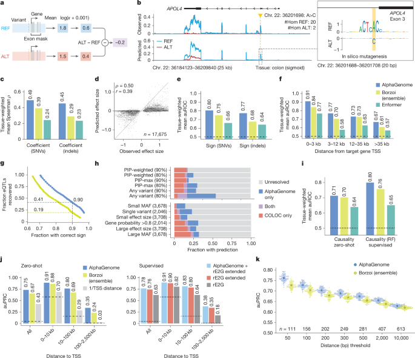
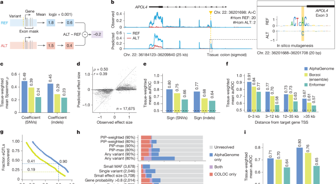
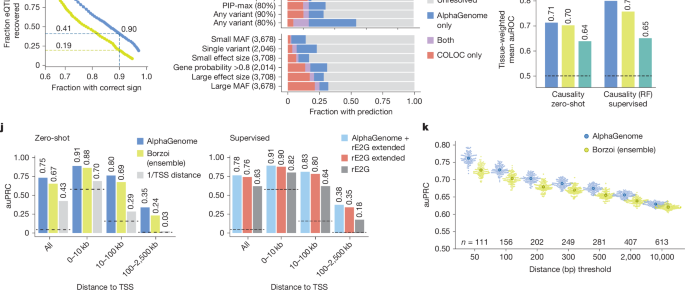

# Figure 4. Predicting the effect of variants on gene expression

Figure 4는 AlphaGenome이 **gene expression-related variant effect**를 어떻게 정의하고, eQTL의 **effect size**, **direction(sign)**, **causality**, **enhancer–gene linking**, **polyadenylation QTL**까지 얼마나 폭넓게 예측할 수 있는지를 보여주는 그림입니다.

## Figure 4 전체 보기

{ .figure-wide }

이 figure는 앞쪽과 뒤쪽의 질문이 조금 다릅니다.  
앞부분은 주로 **“이 변이가 target gene expression을 올리는가 내리는가, 그리고 그 크기는 얼마나 되는가?”**를 묻습니다.  
뒤쪽은 거기서 한 단계 더 나아가,  
**GWAS credible set에서 방향을 붙일 수 있는가**,  
**causal eQTL을 고를 수 있는가**,  
**enhancer–gene link를 더 잘 설명할 수 있는가**,  
그리고 **3′ UTR polyadenylation 관련 변이까지 다룰 수 있는가**를 보여줍니다.

??? note "coefficient, sign, causality는 각각 무엇을 묻는가?"

    

    <b>세 가지 질문은 서로 다릅니다.</b> 
    <b>coefficient</b>는 변이가 expression을 얼마나 크게 바꾸는지를 묻는 효과 크기 문제입니다.  

    <b>sign</b>은 그 변화의 방향, 즉 발현을 올리는지 내리는지를 묻는 분류 문제입니다.  

    <b>causality</b>는 어떤 변이가 실제 causal eQTL인지, 아니면 주변 linkage 때문에 같이 보이는 non-causal variant인지를 구분하는 문제입니다.  

    따라서 Figure 4는 단순한 effect size correlation 하나만 보는 것이 아니라,  
    <b>크기, 방향, causal prioritization</b>을 서로 다른 task로 분리해 평가합니다.
    

## 패널 A–G — eQTL effect size와 sign prediction

{ .figure-wide }

### 패널 A — RNA-seq variant score는 target gene exon signal의 signed ALT–REF 차이로 정의한다

패널 A는 expression variant effect score를 어떻게 정의하는지 보여줍니다.  
같은 locus에 대해 **REF allele**과 **ALT allele**을 각각 넣어 RNA-seq signal을 예측한 뒤,  
관심 gene의 **annotated exon 영역**에서 signal을 집계합니다.  
그다음 이 값을 log scale로 변환하고, **ALT − REF**를 취해 signed effect size를 만듭니다.

여기서 Figure 3과의 차이가 분명합니다.  
splicing에서는 방향보다 변화의 크기가 중요해서 절대값 기반 score를 사용했지만,  
expression에서는 **발현이 올라가는지 내려가는지 자체가 생물학적으로 중요**하기 때문에  
부호를 유지한 **signed score**를 사용합니다.  
즉, 이 score는 단순히 “영향이 있다”가 아니라  
**“ALT가 target gene expression을 증가시키는지 감소시키는지”**를 말해 주는 값입니다.

### 패널 B — APOL4 eQTL 예시와 ISM

패널 B는 GTEx **colon (sigmoid)** 에서의 APOL4 eQTL/sQTL 예시입니다.  
변이는 **chr. 22: 36201698 A>C**이고,  
GTEx에서 alternative C allele은 APOL4 발현 감소와 연결됩니다.  
패널의 왼쪽에서는 observed coverage와 predicted coverage가 REF/ALT로 나뉘어 나오고,  
오른쪽 inset에서는 variant 주변 20 bp 구간의 comparative ISM이 제시됩니다.

이 예시가 좋은 이유는 단순한 expression change만 보여주지 않기 때문입니다.  
AlphaGenome은 **ALT allele에서 APOL4 RNA-seq coverage가 감소하는 방향**을 재현할 뿐 아니라,  
ISM을 보면 이 위치가 단순 enhancer motif가 아니라 **splice donor-like sequence motif**와도 연결되어 있음을 시사합니다.  
즉, 이 locus에서는 expression effect가 순수한 enhancer strength 변화라기보다  
**local splicing perturbation을 통해 transcript가 비정상화되면서 expression이 낮아지는 메커니즘**으로 해석될 수 있습니다.

이 패널은 Figure 4 전체에서 중요한 역할을 합니다.  
왜냐하면 논문이 expression variant prediction을 단순 black-box regression으로 내놓는 것이 아니라,  
**local sequence mechanism을 ISM으로 다시 들여다볼 수 있다**는 점을 먼저 보여주기 때문입니다.

### 패널 C–D — effect size prediction

패널 C와 D는 expression **effect size**를 얼마나 잘 맞추는지를 정량적으로 보여줍니다.  
패널 C의 막대는 49개 GTEx tissue에 대해 계산한 tissue-weighted mean **Spearman’s ρ**로,  
SNV와 indel을 따로 나누어 비교합니다.  
여기서 AlphaGenome은 Borzoi와 Enformer보다 더 높은 coefficient prediction 성능을 보입니다.

패널 D는 한 단계 더 직접적인 그림입니다.  
17,675개의 fine-mapped GTEx eQTL SNV에 대해,  
x축에는 observed effect size, y축에는 AlphaGenome predicted score를 놓고 비교합니다.  
이때 **signed correlation**이 unsigned correlation보다 훨씬 높게 유지된다는 점이 중요합니다.  
즉, AlphaGenome은 “이 변이가 expression을 어느 방향으로 바꿀지”는 비교적 잘 맞추지만,  
각 변이의 **정확한 절대 effect size magnitude**까지 완벽하게 복원하는 일은 여전히 더 어렵다는 뜻입니다.

이건 sequence-to-function 모델의 현실적인 한계를 잘 보여줍니다.  
실제 사람 집단 데이터에서 관측되는 eQTL effect는 sequence 자체뿐 아니라  
개체 간 배경, LD 구조, measurement noise, cellular composition의 영향도 함께 받기 때문입니다.  
그래서 Figure 4의 coefficient task는 모델이 직접 sequence만 보고 풀기에는 원래부터 어려운 문제입니다.

### 패널 E–G — sign prediction과 confidence–recall trade-off

패널 E는 effect size 자체보다 더 실용적인 질문,  
즉 **“expression이 증가하느냐 감소하느냐”**를 맞출 수 있는지를 평가합니다.  
SNV와 indel 모두에서 AlphaGenome은 sign prediction auROC가 더 높고,  
특히 indel에서도 Borzoi보다 일관되게 강한 성능을 보입니다.

패널 F는 이를 variant–TSS distance로 나누어 봅니다.  
보통 eQTL task는 TSS와 가까울수록 쉬워지고, 멀어질수록 어려워집니다.  
그런데 AlphaGenome은 distal bin에서도 비교적 안정적으로 sign prediction 성능을 유지합니다.  
즉, **long-range context를 많이 보는 구조적 이점**이 여기서 드러난다고 볼 수 있습니다.

패널 G는 매우 실용적인 그림입니다.  
score threshold를 점점 높여 갈 때,  
**정확도는 얼마나 올라가고**,  
그 대신 **전체 eQTL 중 몇 %를 회수할 수 있는지**를 동시에 보여줍니다.  
논문 본문이 강조하듯, sign accuracy를 약 90% 수준으로 맞추는 조건에서도  
AlphaGenome은 Borzoi보다 훨씬 더 많은 eQTL을 남겨 둡니다.  
즉, 같은 confidence를 요구할 때 **coverage가 더 넓다**는 뜻입니다.

이건 downstream interpretation에서 상당히 중요합니다.  
실전에서는 “무조건 많이 예측하는 모델”보다  
**정확도를 일정 수준 이상 유지하면서도 충분한 수의 candidate를 남겨 주는 모델**이 더 유용하기 때문입니다.

??? note "왜 Figure 4에서는 signed score가 중요할까?"

    

    <b>expression은 방향이 핵심입니다.</b> 
    splicing에서는 “정상 구조를 얼마나 깨뜨리느냐”가 핵심이라 절대값 기반 score가 자연스럽지만,  
    expression에서는 같은 크기의 변화라도 <b>올리는 것과 내리는 것의 의미가 다릅니다.</b>  

    예를 들어 oncogene은 발현 증가가, haploinsufficient gene은 발현 감소가 더 중요할 수 있습니다.  
    그래서 Figure 4에서는 score 정의부터 benchmark까지 <b>방향(sign)</b>을 핵심 축으로 따로 평가합니다.
    

## 패널 H–K — GWAS, causality, enhancer–gene linking, polyadenylation

{ .figure-wide }

### 패널 H — GWAS credible set에서 direction of effect를 붙일 수 있는가

패널 H는 sequence-based expression sign prediction이 **GWAS credible set 해석**에 얼마나 도움이 되는지를 보여줍니다.  
여기서 credible set은 통계적으로 causal variant가 포함되어 있을 가능성이 높은 변이 후보 집합이고,  
패널의 막대는 그 credible set들 가운데 **plausible target gene에 대해 effect direction을 붙일 수 있었던 비율**을 보여줍니다.

이 그림에서 중요한 메시지는 AlphaGenome과 COLOC이 완전히 같은 문제를 풀지 않는다는 점입니다.  
COLOC은 eQTL과 GWAS signal이 같은 causal variant를 공유하는지 보는 **통계적 colocalization**이고,  
AlphaGenome은 sequence만 보고 **variant가 target gene expression을 어느 방향으로 바꿀지** 예측합니다.  
그래서 두 방법이 겹치는 locus도 있지만,  
상당수는 **AlphaGenome only** 또는 **COLOC only**로 남습니다.

즉, 이 패널의 요지는 “AlphaGenome이 COLOC을 대체한다”가 아니라,  
**sequence-based sign prediction과 statistical colocalization이 상호보완적**이라는 데 있습니다.  
실제로 논문은 둘을 함께 쓸 때 방향 해석이 가능한 locus 수가 더 늘어난다고 설명합니다.

### 패널 I — eQTL causality prediction

패널 I는 causal eQTL과 주변 non-causal variant를 구분하는 **causality** task입니다.  
zero-shot 설정에서는 AlphaGenome과 Borzoi가 비슷하거나 AlphaGenome이 조금 앞서는 수준이지만,  
더 중요한 것은 **supervised random forest setting**입니다.  
여기서 AlphaGenome이 만든 multimodal feature를 넣으면 mean auROC가 더 높아집니다.

이 패널의 핵심은 단순합니다.  
AlphaGenome은 zero-shot predictor로도 쓸 수 있지만,  
더 나아가 **downstream classifier가 활용하기 좋은 feature generator**이기도 하다는 것입니다.  
특히 논문은 RNA-seq-derived score만이 아니라  
여러 modality에서 나온 score를 함께 쓰면 성능이 더 오른다고 보고합니다.  
즉, causal eQTL prioritization에서는 expression 하나만 보는 것보다  
**multimodal representation 자체가 도움이 된다**는 뜻입니다.

### 패널 J — enhancer–gene linking

패널 J는 **ENCODE–rE2G CRISPRi dataset**에서 enhancer–gene linking을 평가한 결과입니다.  
왼쪽의 zero-shot 평가는 distance bin별로,  
AlphaGenome과 Borzoi, 그리고 거리 기반 baseline이 enhancer–gene 연결을 얼마나 잘 맞추는지 보여줍니다.  
오른쪽 supervised 평가는 AlphaGenome의 input gradient score를 기존 rE2G logistic regression 모델에 추가했을 때 성능이 어떻게 달라지는지를 보여줍니다.

이 패널의 포인트는 long-range regulation입니다.  
expression sign task는 주로 variant–gene 관계를 보지만,  
enhancer–gene linking은 **어떤 distal regulatory element가 어떤 gene을 조절하는지**를 맞춰야 합니다.  
AlphaGenome이 zero-shot에서도 경쟁력 있고, supervised model에 feature로 넣었을 때도 이득을 준다는 것은  
이 모델이 단순 local motif effect뿐 아니라  
**장거리 regulatory coupling에 관한 유용한 signal**을 내부 표현에 담고 있다는 뜻입니다.

### 패널 K — polyadenylation QTL (paQTL)

패널 K는 Figure 4에서 조금 이질적으로 보이지만, 사실 매우 중요한 부분입니다.  
여기서는 **paQTL**, 즉 polyadenylation site 사용에 영향을 주는 variant를 평가합니다.  
각 swarm plot은 positive SNP를 distance- and expression-matched negative와 무작위로 짝지은 100회 permutation 결과이고,  
큰 점은 그 평균 성능입니다.

이 결과가 흥미로운 이유는 AlphaGenome이 **explicit polyadenylation head 없이도** 이 task를 잘 푼다는 점입니다.  
논문은 RNA-seq coverage prediction만으로도 proximal/distal PAS 간 경쟁이 어느 정도 드러나기 때문에,  
paQTL detection이 가능하다고 해석합니다.  
실제로 AlphaGenome은 Borzoi를 전 거리 구간에서 앞서고,  
특히 PAS와 매우 가까운 proximal paQTL에서 더 좋은 성능을 보입니다.

즉, Figure 4는 expression variant prediction을 단순 eQTL sign prediction으로 좁게 보지 않습니다.  
RNA-seq를 중심으로 출발하지만, 그 결과를 **direction assignment, causality prioritization, distal enhancer–gene linking, APA-related paQTL**까지 확장해 쓰고 있다는 점이 이 figure의 핵심입니다.

??? note "SuSiE β posterior, PIP, credible set, COLOC"

    

    <b>자주 나오는 fine-mapping 용어들.</b> 
    <b>SuSiE β posterior</b>는 fine-mapping에서 추정한 variant effect size의 posterior estimate로,  
    여기서는 eQTL coefficient task의 정답(effect size proxy)로 사용됩니다.  

    <b>PIP</b>는 posterior inclusion probability로,  
    해당 variant가 causal일 확률을 뜻합니다.  

    <b>credible set</b>은 PIP가 높은 variant들을 모은 후보 집합으로,  
    “진짜 causal variant가 이 안에 있을 가능성이 높다”는 의미입니다.  

    <b>COLOC</b>은 GWAS signal과 eQTL signal이 같은 causal variant를 공유하는지를 보는 통계적 방법입니다.  
    Figure 4에서는 COLOC과 AlphaGenome의 sequence-based sign prediction이  
    서로 다른 강점을 가지므로 함께 쓰면 더 많은 locus를 해석할 수 있다는 점이 중요합니다.
    

Figure 4의 핵심은 AlphaGenome이 단순히 “이 변이가 expression에 영향이 있다”를 넘어서,  
**effect size**, **direction of effect**, **causal prioritization**, **enhancer–gene linking**, **polyadenylation-related regulation**까지 이어지는  
표현형 해석용 feature를 sequence만으로 생성할 수 있다는 점입니다.

