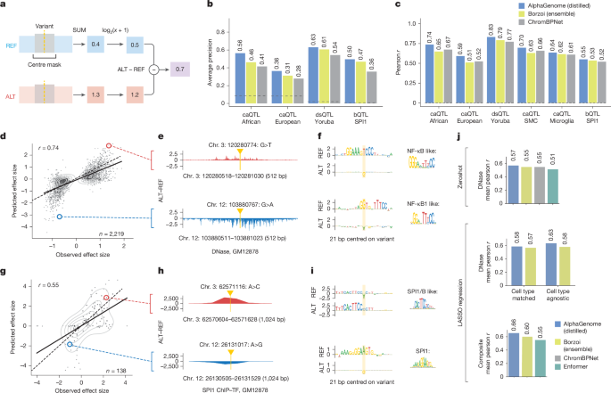
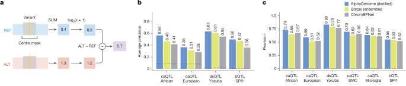
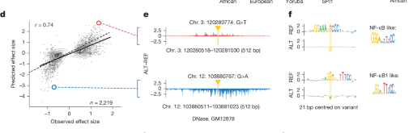
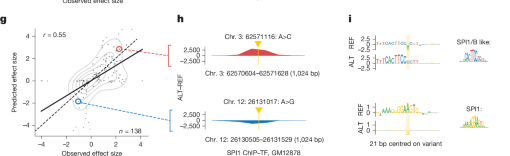
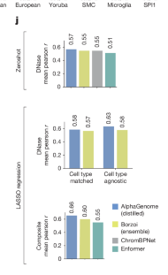

# Figure 5. Predicting variant effects on chromatin accessibility and SPI1 binding

Figure 5는 AlphaGenome이 **chromatin accessibility, DNase sensitivity, transcription factor binding**과 관련된 variant effect를 얼마나 잘 예측하는지를 보여줍니다.  
구성은 비교적 직관적입니다. 먼저 **local chromatin task에 맞는 scoring rule**을 정의하고, 그다음 QTL benchmark에서 causality와 effect size를 평가하며, 이어서 실제 caQTL과 SPI1 bQTL 예시를 통해 **ALT–REF track difference와 motif 해석**을 보여주고, 마지막으로 MPRA benchmark까지 확장합니다.

## Figure 5 전체 보기

{ .figure-wide }

## 패널 A–C — local chromatin task에서 어떤 score를 쓰고, benchmark에서는 어떤 결과가 나오는가

{ .figure-wide }

### 패널 A — centre-mask variant scoring

패널 A는 accessibility와 ChIP-seq 예측에서 variant score를 어떻게 정의했는지를 설명합니다.  
여기서는 Figure 4의 expression scorer처럼 gene exon을 합산하지 않고,  
variant 주변의 **local window**만을 봅니다.  
구체적으로는 variant를 중심으로 한 구간에서 signal을 합산하거나 변환한 뒤, **ALT − REF** 차이를 effect score로 사용합니다.

이렇게 local window를 쓰는 이유는 accessibility와 TF binding effect가 대체로 **매우 국소적**이기 때문입니다.  
예를 들어 enhancer motif 하나가 깨지면 그 영향은 대개 수십~수백 bp 범위의 DNase/ATAC/ChIP signal 변화로 나타납니다.  
따라서 1 Mb 전체에서 가장 큰 변화를 찾기보다,  
**변이 주변 중앙 영역만 mask 혹은 집계해서 보는 방식이 이 task에 더 적절**합니다.

즉, Figure 5의 score는  
“이 변이가 genome 전체를 얼마나 흔드는가”가 아니라,  
**“이 변이가 자기 주변의 local regulatory signal을 얼마나 바꾸는가”**를 묻는 scorer라고 이해하면 됩니다.

### 패널 B — causality benchmark

패널 B는 fine-mapped QTL benchmark에서 **causal variant를 맞히는 능력**을 비교합니다.  
평가 지표는 average precision이고,  
비교 대상은 AlphaGenome, Borzoi, ChromBPNet, 그리고 baseline입니다.

중요한 점은 이 benchmark가 한 가지 데이터셋이 아니라  
**caQTL, dsQTL, bQTL**처럼 서로 다른 task와 여러 ancestry/cell type을 묶어 놓은 것이라는 점입니다.  
즉, AlphaGenome이 한 조건에서만 우연히 좋은 것이 아니라,  
chromatin state와 TF binding 관련 task 전반에서 안정적으로 높은 causality 성능을 보인다는 것을 요약한 그림입니다.

특히 ChromBPNet은 local chromatin accessibility에 특화된 strong specialist model인데,  
그 모델과 비교해도 AlphaGenome이 causality task에서 경쟁력 있거나 더 나은 성능을 보인다는 점이 중요합니다.  
이건 multimodal generalist model이 local accessibility specialist와 비교해서도 충분히 강해졌음을 뜻합니다.

### 패널 C — effect size benchmark

패널 C는 같은 계열의 QTL에 대해 **effect size correlation**을 비교합니다.  
즉, causal 여부만 맞히는 것이 아니라,  
실험적으로 관측된 effect size와 모델 score가 얼마나 잘 대응되는지를 **Pearson r**로 평가합니다.

이 그림에서 봐야 할 포인트는,  
AlphaGenome이 caQTL African/European, dsQTL Yoruba, 그리고 특정 cell type accessibility나 SPI1 bQTL 등  
서로 다른 setting에서 전반적으로 높은 상관을 유지한다는 점입니다.  
즉, 이 모델은 단순히 positive와 negative를 분류하는 능력만 있는 것이 아니라,  
**effect magnitude의 연속적인 차이**까지 어느 정도 반영할 수 있습니다.

??? note "caQTL, dsQTL, bQTL은 무엇인가?"

    

    <b>세 가지 QTL의 차이.</b> 
    <b>caQTL</b>은 chromatin accessibility QTL로,  
    특정 variant가 열린 chromatin 정도를 바꾸는 경우입니다.  

    <b>dsQTL</b>은 DNase sensitivity QTL로,  
    DNase 신호를 바꾸는 accessibility-related QTL입니다.  

    <b>bQTL</b>은 binding QTL로,  
    특정 transcription factor의 binding 강도를 바꾸는 변이를 뜻합니다.  

    Figure 5는 이 세 종류를 함께 다루면서,  
    AlphaGenome이 accessibility와 TF binding을 모두 예측할 수 있는 unified model임을 보여줍니다.
    

## 패널 D–F — caQTL example과 NF-κB-like motif 해석

{ .figure-wide }

패널 D–F는 accessibility benchmark의 정량 결과를 실제 예시로 풀어 보여주는 부분입니다.

### 패널 D — predicted vs observed effect size for causal caQTLs

패널 D는 African ancestry caQTL에 대해,  
x축에 observed effect size, y축에 predicted effect size를 둔 scatter plot입니다.  
이때 사용한 track은 **GM12878 DNase prediction**이고,  
signed Pearson r가 0.74로 상당히 높습니다.

이 그림을 읽을 때는 단순히 상관계수 숫자만 보지 말고,  
점들이 대각선 방향을 따라 분포하는지,  
그리고 양의 효과와 음의 효과를 둘 다 어느 정도 구분하는지를 함께 봐야 합니다.  
즉, 모델이 “영향이 있는가”만 맞추는 것이 아니라  
**ALT가 accessibility를 올리는지 내리는지, 그리고 대략 어느 정도인지**까지 포착하고 있다는 뜻입니다.

빨간 원과 파란 원으로 표시된 두 점은 패널 E와 F에서 자세히 들여다보는 example variant입니다.

### 패널 E — ALT–REF DNase difference track

패널 E는 패널 D에서 강조한 예시 variant 두 개에 대해,  
variant 주변의 **ALT − REF predicted DNase difference**를 직접 보여줍니다.  
여기서는 y축의 absolute signal보다도,  
**variant 근처에서 차이가 어느 방향으로 생기는지**를 보는 것이 중요합니다.

빨간 example에서는 ALT가 accessibility를 높이는 방향의 local signal 변화가 나타나고,  
파란 example에서는 반대로 낮추는 방향의 변화가 나타납니다.  
즉, 패널 E는 scatter plot 한 점이 실제 sequence context에서는  
어떤 local chromatin pattern 변화로 실현되는지를 보여주는 bridge 역할을 합니다.

### 패널 F — ISM-derived sequence logos와 motif 해석

패널 F는 바로 그 두 variant에 대해 수행한 ISM-derived sequence logos입니다.  
여기서 REF와 ALT 배경에서 어떤 염기 치환이 score에 큰 영향을 주는지를 보면,  
논문이 지적하듯 **NF-κB-like motif** 변화가 드러납니다.

이 부분이 중요한 이유는 패널 D의 correlation과 패널 E의 track change가  
단순 통계적 우연이 아니라 **local TF motif logic**과 연결된다는 점을 보여주기 때문입니다.  
즉, accessibility effect prediction은 결국 TF binding grammar와 연결되어 있고,  
AlphaGenome은 그 motif-level determinant를 어느 정도 포착하고 있다는 뜻입니다.

## 패널 G–I — SPI1 bQTL example과 SPI1 motif 해석

{ .figure-wide }

패널 G–I는 caQTL accessibility 예시와 같은 논리를,  
이번에는 **SPI1 bQTL**에 대해 보여줍니다.

### 패널 G — predicted vs observed effect size for causal SPI1 bQTLs

패널 G는 SPI1 binding QTL에 대해 predicted effect size와 observed effect size를 비교한 scatter plot입니다.  
사용한 track은 **GM12878 SPI1 ChIP-seq**이고,  
signed Pearson r는 0.55입니다.  
caQTL 예시보다는 다소 낮지만, 여전히 meaningful한 상관을 보입니다.

여기서 해석 포인트는 accessibility보다 TF binding task가 더 좁고 민감한 motif dependence를 가지기 때문에,  
score가 조금만 흔들려도 effect size 해석이 더 어려울 수 있다는 점입니다.  
그럼에도 불구하고 AlphaGenome은 binding QTL에서도 direction과 magnitude를 어느 정도 따라갑니다.

### 패널 H — ALT–REF SPI1 ChIP difference track

패널 H는 예시 variant 두 개에서 **ALT − REF predicted SPI1 ChIP track**을 보여줍니다.  
이 그림은 패널 E와 비슷하지만,  
이번에는 accessibility가 아니라 **SPI1 결합 자체가 얼마나 달라지는지**를 직접 본다는 차이가 있습니다.

즉, 모델은 “이 변이가 chromatin이 열릴지”만 보는 것이 아니라,  
**특정 transcription factor의 binding profile이 local sequence 변화에 따라 어떻게 달라지는지**도 직접 예측합니다.  
이 점이 Figure 5 제목에 accessibility와 SPI1 binding이 함께 들어가는 이유입니다.

### 패널 I — SPI1-like motif 해석

패널 I의 ISM logos는 이 bQTL effect가 실제로 **SPI1-like motif** 변화와 연결될 수 있음을 보여줍니다.  
즉, 어떤 variant는 기존 SPI1 motif를 약화시키고,  
어떤 variant는 반대로 SPI1 또는 related factor가 결합하기 좋은 sequence context를 만들어 줄 수 있습니다.

결국 패널 G–I는 Figure 5의 메시지를 accessibility에서 TF-specific binding까지 확장합니다.  
AlphaGenome은 DNase/ATAC 같은 broad accessibility signal뿐 아니라,  
**특정 TF binding logic 자체도 local sequence 수준에서 추적할 수 있다**는 뜻입니다.

??? note "ALT−REF track과 ISM logo는 어떻게 같이 읽어야 하나?"

    

    <b>둘은 서로 다른 수준의 해석입니다.</b> 
    <b>ALT−REF track</b>은 실제 예측 결과가 variant 주변에서 얼마나 커지거나 줄어드는지를 보여주는 출력 수준의 그림입니다.  

    <b>ISM logo</b>는 그 변화가 어떤 염기와 motif에 의해 설명될 수 있는지를 보여주는 입력 수준의 해석입니다.  

    따라서 Figure 5의 example panels는  
    <b>effect size correlation → local track change → motif determinant</b>라는 3단계 흐름으로 읽으면 가장 자연스럽습니다.
    

## 패널 J — CAGI5 MPRA benchmark

{ .figure-medium }

패널 J는 population QTL benchmark를 넘어,  
**CAGI5 saturation mutagenesis MPRA challenge**에서 AlphaGenome이 얼마나 잘 작동하는지를 보여줍니다.  
이 task는 짧은 sequence의 regulatory activity를 reporter assay로 측정한 값과 예측을 비교하는 문제입니다.

이 그림은 위에서 아래로 세 층위로 읽으면 됩니다.

첫째, **zero-shot**에서는 cell-type-matched DNase predictions만 사용합니다.  
이 경우 AlphaGenome은 ChromBPNet과 Borzoi ensemble에 비교적 근접한 성능을 보입니다.

둘째, **LASSO using DNase**에서는 여러 cell type의 DNase feature를 함께 묶어 회귀합니다.  
즉, 특정 one-to-one matched track 하나만 보는 것이 아니라  
AlphaGenome이 예측한 accessibility landscape 전체를 feature로 활용합니다.  
이때 성능이 더 올라갑니다.

셋째, **multimodal LASSO**에서는 DNase뿐 아니라 RNA와 histone ChIP-seq 같은 다른 modality까지 함께 넣습니다.  
여기서 AlphaGenome은 가장 높은 평균 Pearson r를 보이며,  
논문이 말하듯 multimodal integration이 MPRA task에도 실제로 도움이 된다는 점을 보여줍니다.

즉, Figure 5의 마지막 메시지는 분명합니다.  
AlphaGenome은 local chromatin QTL benchmark에서도 강하지만,  
그 출력들을 조합하면 **regulatory activity prediction을 위한 일반적인 feature bank**로도 활용될 수 있습니다.

Figure 5의 핵심은 AlphaGenome이 chromatin accessibility와 TF binding 변이를  
단순 분류 수준이 아니라 **effect size**, **local track difference**, **motif mechanism**, **MPRA generalization**까지 이어서 설명할 수 있다는 점입니다.

