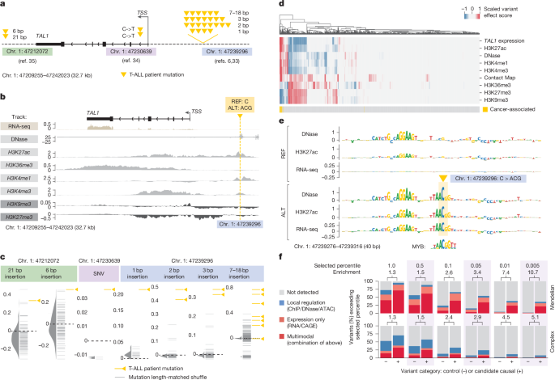
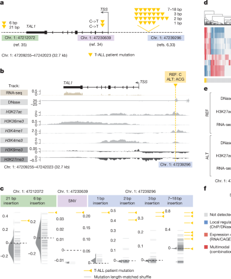
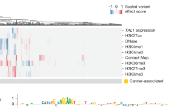
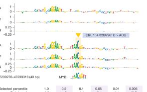
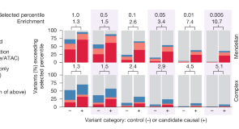

# Figure 6. Interpreting variant effects across modalities with AlphaGenome

Figure 6는 AlphaGenome의 가장 흥미로운 활용 예시 중 하나입니다.  
앞의 Figure 3–5가 각 modality별 benchmark를 보여줬다면, Figure 6는 하나의 실제 disease locus에서 **RNA-seq, accessibility, histone mark, motif logic, trait-variant enrichment**를 한 번에 엮어 해석할 수 있음을 보여줍니다.  
즉, 이 figure의 질문은 “성능이 좋은가?”보다는 **“이 모델이 실제 non-coding disease variant를 어떻게 설명해 주는가?”**에 더 가깝습니다.

## Figure 6 전체 보기

{ .figure-wide }

논문은 T cell acute lymphoblastic leukaemia (**T-ALL**)에서 잘 알려진 **TAL1 oncogene** 주변 non-coding mutation들을 예시로 듭니다.  
핵심은 서로 다른 위치와 길이의 돌연변이들이 결국 **TAL1 upregulation**이라는 공통 결과로 수렴한다는 점이고,  
AlphaGenome이 그 공통 메커니즘을 **여러 modality에서 동시에** 재현해 준다는 데 있습니다.

??? note "왜 CD34+ CMP track을 보나?"

    

    <b>세포 맥락 선택.</b> 
    논문은 T-ALL 세포 자체의 정확한 training track을 쓰는 대신,  
    사용 가능한 데이터 중에서 <b>CD34+ common myeloid progenitor (CMP)</b>를  
    T-ALL cell of origin에 가장 가까운 맥락으로 사용했습니다.  

    즉, Figure 6은 “환자 세포를 완벽히 재현했다”기보다,  
    <b>T-ALL과 가장 가까운 이용 가능한 전구세포 맥락에서 variant effect를 virtual screening한 예시</b>라고 이해하는 것이 맞습니다.
    

## 패널 A–C — TAL1 locus의 oncogenic mutation을 한 자리에서 바라보기

{ .figure-wide }

### 패널 A — TAL1를 활성화하는 세 종류의 non-coding mutation 그룹

패널 A는 TAL1 locus 주변의 **세 종류의 gain-of-function mutation group**을 먼저 정리합니다.  
5′ neo-enhancer cluster, intronic SNV, 3′ neo-enhancer가 모두 표시되어 있고,  
노란 삼각형은 실제 T-ALL 환자에서 보고된 mutation을 뜻합니다.

이 패널이 먼저 하고 싶은 말은 단순합니다.  
돌연변이의 정확한 위치와 형태는 서로 다르지만,  
이들은 모두 **TAL1을 비정상적으로 켜는 방향**으로 작동하는 것으로 알려져 있습니다.  
즉, AlphaGenome이 풀어야 하는 질문은 “이 mutation이 deleterious인가?”가 아니라,  
**“이 mutation이 어떤 regulatory mechanism을 통해 TAL1 activation으로 이어지는가?”**입니다.

### 패널 B — oncogenic insertion의 ALT−REF multimodal track difference

패널 B는 그중에서도 대표적인 oncogenic insertion  
**chr. 1: 47239296 C>ACG**에 대해,  
CD34+ CMP track에서 **ALT − REF** 차이를 보여줍니다.  
여기서는 observed와 predicted를 나란히 두는 Figure 2류의 그림이 아니라,  
변이 전후 차이 자체를 바로 그려 놓았다는 점이 다릅니다.

이 패널에서 가장 먼저 봐야 할 것은 **variant 위치 근처의 local activation signal**입니다.  
ALT sequence는 변이 주변에서 **DNase, H3K27ac, H3K4me1** 같은 활성 enhancer와 관련된 신호를 증가시키고,  
이는 그 자리에 **neo-enhancer**가 생겼다는 기존 실험적 해석과 잘 맞습니다.

동시에 TAL1 TSS와 gene body를 보면 더 넓은 맥락도 보입니다.  
논문이 설명하듯, ALT는 TAL1 근처에서 **repressive mark인 H3K9me3/H3K27me3를 낮추고**,  
gene body에서 **active transcription-related mark인 H3K36me3를 높이며**,  
결국 **RNA-seq signal 증가**와도 연결됩니다.  
즉, 하나의 짧은 insertion이 단순 local motif change에 그치지 않고,  
**chromatin state → transcriptional output**로 이어지는 연쇄 변화를 유도하는 양상이 나타납니다.

### 패널 C — 환자 mutation과 matched shuffle controls의 TAL1 expression score 비교

패널 C는 TAL1 expression score를 mutation group별로 요약한 그림입니다.  
여기서 중요한 비교는 실제 **patient mutation**과 길이 및 sequence 구성을 맞춘 **matched shuffle control** 사이의 차이입니다.  
즉, 같은 길이의 indel이면 다 비슷한 effect가 나는 것이 아니라,  
실제 oncogenic mutation이 **유난히 TAL1 expression을 높이는 sequence**라는 점을 보려는 것입니다.

이 결과는 Figure 6 전체에서 매우 중요한 bridge 역할을 합니다.  
패널 B가 한 mutation의 mechanistic deep dive였다면,  
패널 C는 그 논리를 여러 mutation group으로 확장했을 때도  
실제 oncogenic mutation이 control보다 더 큰 TAL1 upregulation score를 보인다는 사실을 보여줍니다.  
즉, AlphaGenome의 해석이 우연한 single example에 머물지 않는다는 뜻입니다.

## 패널 D — multimodal heat map은 mutation마다 서로 다른 경로가 있지만 공통 방향은 TAL1 activation임을 보여준다

{ .figure-medium }

패널 D는 Figure 6에서 가장 정보량이 많은 부분입니다.  
각 **열**은 패널 C의 개별 variant 하나를 뜻하고,  
각 **행**은 하나의 genome track 또는 variant effect score를 뜻합니다.  
즉, 이 그림은 각 mutation이 RNA-seq, DNase, histone mark, contact map 등 여러 readout에 어떤 영향을 줄지 **동시에** 요약한 multimodal heat map입니다.

이 그림은 두 가지를 말해 줍니다.

첫째, 모든 mutation이 같은 방식으로 작동하지는 않습니다.  
어떤 mutation은 accessibility와 active histone mark를 강하게 올리고,  
어떤 mutation은 RNA-level score가 더 두드러지며,  
어떤 mutation은 보다 제한적인 local effect만 보입니다.  
즉, **메커니즘의 세부 경로는 mutation마다 다를 수 있습니다.**

둘째, 그럼에도 불구하고 clustering을 해 보면 oncogenic mutation들은  
대체로 **TAL1 activation과 양립 가능한 multimodal signature**를 공유합니다.  
즉, AlphaGenome은 이 locus에서 하나의 정답 readout만 보는 것이 아니라,  
**여러 modality를 통해 같은 생물학적 결론을 서로 다른 증거선으로 뒷받침**하고 있습니다.

이 패널이 Figure 6의 제목과 가장 잘 맞는 부분입니다.  
논문이 말하는 multimodal interpretation은 단순히 “출력이 여러 개 있다”는 뜻이 아니라,  
**하나의 variant를 여러 분자적 readout에서 동시에 해석할 수 있다**는 뜻입니다.

## 패널 E — REF sequence에는 없던 MYB motif가 ALT sequence에서 새로 생긴다

{ .figure-medium }

패널 E는 대표 oncogenic insertion에 대한 **ISM 결과**입니다.  
위쪽은 reference sequence, 아래쪽은 alternative sequence에서의 ISM이고,  
DNase, H3K27ac, TAL1 RNA-seq 세 readout을 함께 보여줍니다.

이 그림의 핵심은 논문이 직접 강조하듯 아주 선명합니다.  
**REF background에서는 variant 주변 40 bp 안에 TAL1 expression을 크게 바꿀 만한 motif sensitivity가 거의 없는데,  
ALT background에서는 variant 위치에 MYB motif가 새로 등장하면서 DNase, H3K27ac, RNA-seq이 함께 증가하는 방향의 sensitivity가 생깁니다.**

즉, AlphaGenome은 단순히 “이 indel은 큰 effect가 있다”에서 멈추지 않고,  
그 효과가 **새로운 MYB binding opportunity의 생성** 때문일 수 있음을 sequence 수준에서 제시합니다.  
논문은 이것이 기존 연구에서 제안된 mechanism과도 일치한다고 설명합니다.

또 하나 흥미로운 점은, 모델이 MYB motif 외에도 근처의 **ETS-like motif**에 민감한 신호를 포착한다는 것입니다.  
논문은 이 motif의 기능은 아직 불확실하다고 말하지만,  
바로 이런 부분이 AlphaGenome 같은 모델의 장점입니다.  
즉, 기존에 알려진 mechanism을 재현할 뿐 아니라,  
**추가적인 candidate mechanism**까지 hypothesis 수준으로 제시할 수 있다는 뜻입니다.

??? note "패널 B와 패널 E는 어떻게 연결되나?"

    

    <b>패널 B는 출력 수준, 패널 E는 입력 수준의 해석입니다.</b> 
    패널 B는 ALT sequence가 실제로 DNase, histone mark, RNA-seq을 어떻게 바꾸는지를 보여줍니다.  

    패널 E는 그 변화가 왜 생겼는지를 sequence motif 수준에서 설명합니다.  
    즉, <b>ALT−REF multimodal output</b>과 <b>ISM motif logic</b>가 서로 이어질 때,  
    모델의 variant interpretation이 훨씬 설득력을 얻습니다.
    

## 패널 F — 높은 quantile-score threshold는 trait-altering variant를 enrichment한다

{ .figure-medium }

패널 F는 TAL1 단일 locus를 넘어,  
AlphaGenome score가 좀 더 일반적인 **trait-altering non-coding variant** 해석에도 도움이 되는지를 평가합니다.  
여기서 막대는 candidate causal variant와 matched control variant를 비교하고,  
variant가 일정 **quantile-score threshold**를 넘는지 여부를 기준으로 enrichment를 계산합니다.

이 패널은 두 축으로 읽어야 합니다.

첫째, threshold가 올라갈수록 enrichment는 커집니다.  
즉, **매우 높은 AlphaGenome score를 보이는 variant는 실제 candidate causal variant일 가능성이 더 높아집니다.**  
하지만 동시에 recall은 떨어집니다.  
즉, 이런 thresholding은 “많이 잡는 전략”이 아니라 **정말 강한 candidate를 우선순위화하는 전략**입니다.

둘째, variant를 **local regulation**, **expression only**, **multimodal** 카테고리로 나눴다는 점이 중요합니다.  
즉, 어떤 variant는 DNase/ATAC/ChIP 같은 local regulatory track에서만 강하고,  
어떤 variant는 RNA/CAGE만 강하며,  
어떤 variant는 두 축 모두에서 strong score를 냅니다.  
Figure 6는 바로 이런 식으로 **변이의 가능한 작동 메커니즘을 modality 조합으로 분류**할 수 있음을 보여줍니다.

논문이 강조하듯, AlphaGenome은 phenotype 자체를 직접 예측하는 모델은 아닙니다.  
하지만 패널 F는 높은 multimodal score가  
**candidate causal non-coding variant를 추리는 데 유용한 기능적 힌트**가 될 수 있음을 보여줍니다.

Figure 6의 핵심은 AlphaGenome이 non-coding disease variant를  
단순히 “효과가 있다/없다”로 점수화하는 데서 끝나지 않고,  
**어떤 motif가 생기거나 깨졌는지**,  
**chromatin accessibility와 histone mark가 어떻게 바뀌는지**,  
**결국 target gene expression이 어떤 방향으로 움직이는지**를  
한 locus 안에서 동시에 설명할 수 있다는 점입니다.

