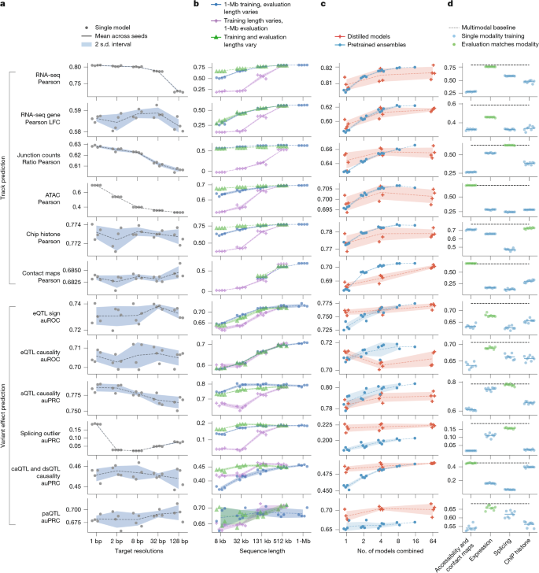
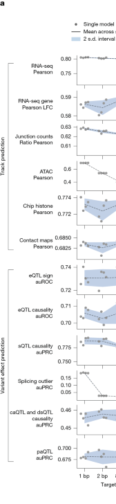
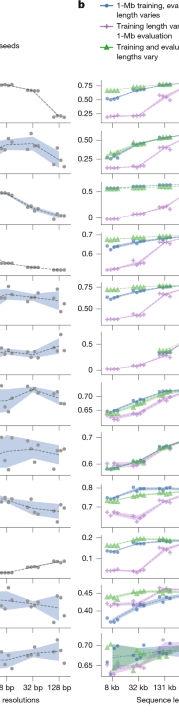
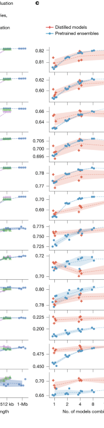
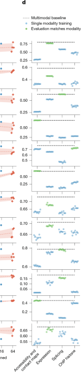

# Figure 7. Impact of resolution, sequence length, ensembling, distillation and multimodal training

Figure 7는 AlphaGenome이 왜 지금의 형태로 설계되었는지를 보여주는 **ablation figure**입니다.  
앞의 figure들이 “무엇을 잘하느냐”를 보여줬다면, 이 figure는  
**왜 1-bp resolution이 중요한지**,  
**왜 1-Mb context를 쓰는지**,  
**왜 distillation이 필요한지**,  
**왜 multimodal training이 이득이 되는지**를 정량적으로 해부합니다.

## Figure 7 전체 보기

{ .figure-wide }

이 figure는 네 개의 세로 패널로 구성되어 있습니다.  
왼쪽부터 순서대로 **resolution**, **sequence length**, **ensembling/distillation**, **multimodal learning**의 영향을 봅니다.  
또 y축에 놓인 지표도 둘로 나뉩니다. 위쪽은 주로 **track prediction** 계열이고, 아래쪽은 **variant effect prediction** 계열입니다.

??? note "Figure 7을 읽을 때 먼저 알아둘 것"

    

    <b>위쪽과 아래쪽 지표가 다릅니다.</b> 
    위쪽 절반은 RNA-seq Pearson, ATAC Pearson, contact map Pearson처럼  
    <b>실제 genome track prediction 자체의 정확도</b>를 보는 지표입니다.  

    아래쪽 절반은 eQTL sign auROC, sQTL causality auPRC, caQTL/dsQTL causality auPRC처럼  
    <b>variant effect prediction downstream task</b>의 성능을 보는 지표입니다.  

    따라서 Figure 7은 “한 모델이 전체적으로 더 좋다”를 넘어서,  
    <b>설계 선택이 어떤 종류의 task에 특히 큰 영향을 주는지</b>를 비교하게 해 줍니다.
    

## 패널 A — 1-bp target resolution이 세밀한 task에서 가장 좋다

{ .figure-medium }

패널 A는 target resolution을 **1 bp에서 128 bp**까지 바꿨을 때 성능이 어떻게 달라지는지 보여줍니다.  
각 줄은 하나의 평가 지표이고,  
검은 점은 개별 모델, 회색 선은 평균, 파란 음영은 seed 간 불확실성을 나타냅니다.

이 패널의 결론은 논문 본문이 말하듯 꽤 분명합니다.  
**1-bp resolution training이 전반적으로 가장 좋고**,  
특히 fine-scale detail이 중요한 task에서 그 이득이 큽니다.  
예를 들어 splicing-related task나 accessibility task는 target resolution이 거칠어질수록 성능 저하가 더 뚜렷합니다.  
이는 splice donor/acceptor 경계나 narrow accessibility peak처럼  
**염기 단위에 가까운 정밀도**가 필요한 readout에서는 coarse target이 본질적으로 정보를 잃기 때문입니다.

반대로 contact map이나 일부 histone ChIP-seq처럼  
원래 assay 자체의 공간 해상도가 더 거친 task는 resolution 변화에 덜 민감합니다.  
즉, 모든 modality가 같은 resolution sensitivity를 갖는 것은 아니지만,  
전체 모델을 통합적으로 설계할 때는 **가장 정보 손실이 적은 1-bp target이 유리하다**는 쪽으로 그림이 기웁니다.

또 하나 흥미로운 점은 variant effect prediction 지표도 resolution에 영향을 받는다는 점입니다.  
직관적으로는 variant scorer가 exon이나 local window에서 값을 집계하므로  
coarse resolution이어도 괜찮아 보일 수 있지만,  
실제로는 upstream track prediction 자체가 날카로워야 downstream effect score도 좋아집니다.  
즉, Figure 7A는 “고해상도 track prediction이 곧 좋은 variant interpretation의 기반”이라는 점을 다시 확인해 줍니다.

## 패널 B — training과 inference 모두에서 긴 sequence context가 유리하다

{ .figure-medium }

패널 B는 세 종류의 실험을 한 그림에 같이 보여줍니다.

- **파란 점**: 1-Mb로 학습한 모델을, 추론 때만 입력 길이를 줄여 가며 평가
- **보라색 X**: 짧은 길이로 학습한 모델을, 추론은 항상 1-Mb로 맞춰 평가
- **초록색 삼각형**: 학습 길이와 추론 길이를 같은 값으로 맞춘 모델

이 패널은 long context의 효과를 training과 inference로 나누어 생각하게 해 줍니다.

첫째, **training context가 길수록 좋습니다.**  
짧은 길이로 학습한 모델은 나중에 inference에서 1 Mb를 보게 해도,  
처음부터 1 Mb 문맥에서 학습한 모델만큼 잘 올라오지 못합니다.  
즉, 모델이 distal interaction이나 broader regulatory grammar를 배우려면  
**학습 시점부터 긴 문맥을 경험해야 한다**는 뜻입니다.

둘째, **inference context도 길수록 좋습니다.**  
같은 1-Mb-trained 모델이라도 입력 길이를 줄이면 성능이 점진적으로 떨어집니다.  
즉, 모델이 실제로 그 긴 문맥을 사용하고 있다는 뜻입니다.  
이건 “1 Mb를 넣을 수는 있지만 사실 별로 안 쓴다”가 아니라,  
**정말로 긴 주변 서열이 예측 품질에 기여한다**는 강한 증거입니다.

셋째, 실용적인 포인트도 있습니다.  
1-Mb-trained 모델은 입력을 짧게 잘라도,  
그 짧은 길이에서 따로 학습한 matched-length model과 비교적 비슷한 성능을 내는 경우가 많습니다.  
즉, 최고 품질이 필요할 때는 full 1 Mb를 쓰고,  
속도가 더 중요할 때는 inference context를 줄여 쓰는 식의 **속도–성능 trade-off**가 가능하다는 뜻입니다.

## 패널 C — distillation은 ensemble 수준의 성능을 단일 모델로 옮겨온다

{ .figure-medium }

패널 C는 **pretrained model ensemble**과 **distilled single model**을 비교합니다.  
파란 점은 여러 teacher/pretrained model을 평균낸 ensemble이고,  
주황색 X는 1개, 4개, 64개 teacher를 사용해 distill한 student model입니다.

이 패널의 핵심 메시지는 inference cost와 성능 사이의 균형입니다.  
일반적으로 ensemble은 성능이 좋지만, 실제 사용 시에는 여러 모델을 다 돌려야 하므로 비용이 큽니다.  
반면 distillation은 teacher ensemble의 지식을 단일 student에 압축해  
**한 번의 추론으로 강한 성능을 내게 하려는 전략**입니다.

Figure 7C를 보면 distilled student는 많은 task에서 ensemble에 근접하거나,  
어떤 경우에는 오히려 더 좋은 결과를 내기도 합니다.  
즉, distillation은 단순한 경량화가 아니라  
**실질적으로 좋은 variant effect predictor를 더 효율적인 형태로 만드는 방법**으로 기능합니다.

특히 AlphaGenome처럼 수많은 modality를 동시에 다루는 모델에서는  
사용자 입장에서 inference efficiency가 매우 중요합니다.  
그래서 Figure 7C는 단순 engineering detail이 아니라,  
왜 논문이 Figure 1에서 teacher–student distillation 절차를 강조했는지를 설명하는 핵심 패널이라고 볼 수 있습니다.

??? note "왜 ensemble이 아니라 distillation을 택했을까?"

    

    <b>성능과 비용의 균형 문제입니다.</b> 
    ensemble은 여러 모델의 예측을 평균내므로 성능이 좋지만,  
    실제 사용 시 계산 비용과 latency가 큽니다.  

    distillation은 teacher model 여러 개가 가진 예측 패턴을  
    하나의 student model에 학습시키는 방식입니다.  
    따라서 사용자 입장에서는 <b>single-model inference cost</b>로  
    <b>ensemble에 가까운 성능</b>을 얻을 수 있습니다.  

    AlphaGenome처럼 variant effect를 대규모로 스캔하려는 모델에서는  
    이 차이가 실제 활용 가능성에 매우 크게 작용합니다.
    

## 패널 D — multimodal learning은 특히 variant effect task에서 이득이 크다

{ .figure-medium }

패널 D는 여러 modality 중 하나만 학습한 single-modality model과  
모든 modality를 함께 학습한 **full multimodal model**을 비교합니다.  
검은 점선은 multimodal baseline,  
파란 점은 single-modality training,  
초록색 점은 평가 지표와 같은 modality를 학습한 경우를 강조한 것입니다.

이 패널을 해석할 때 중요한 점은,  
single-modality model이 자기 modality의 일부 track prediction에서는 나쁘지 않을 수 있다는 사실입니다.  
예를 들어 accessibility prediction은 accessibility data만으로도 어느 정도 잘 됩니다.  
하지만 variant effect prediction으로 내려오면 이야기가 달라집니다.  
eQTL, sQTL, caQTL 같은 task는 실제로는 여러 regulatory layer가 얽혀 있기 때문에,  
**하나의 modality만 본 모델보다 여러 modality를 함께 본 모델이 더 유리**합니다.

즉, multimodal learning의 진짜 이점은  
“모든 track을 다 예측하니까 편리하다”에서 끝나지 않습니다.  
여러 readout을 함께 학습하면 shared representation이 더 풍부해지고,  
그 결과 **downstream variant interpretation task에서 더 강한 표현**이 만들어집니다.  
Figure 7D는 바로 그 점을 보여줍니다.

논문 본문도 이를 분명히 말합니다.  
accessibility variant처럼 특정 modality 하나만으로도 잘 풀리는 task가 있는 반면,  
eQTL처럼 expression, chromatin, TF binding 등이 얽혀 있는 task는  
full multimodal model의 이득이 더 큽니다.  
즉, multimodal learning의 효과는 **task-dependent**하지만,  
전반적으로 unified model 쪽이 더 넓고 강한 성능을 냅니다.

## Figure 7의 종합 해석

Figure 7을 한 줄로 요약하면, AlphaGenome의 주요 설계 선택은 대부분 우연이 아니라  
**실제로 성능에 의미 있는 기여를 하는 선택**이었다는 것입니다.

- **1-bp resolution**은 fine-scale biology에 중요하다.
- **1-Mb context**는 training과 inference 모두에서 도움이 된다.
- **distillation**은 strong ensemble performance를 효율적으로 옮겨온다.
- **multimodal learning**은 특히 variant effect interpretation에 유리하다.

즉, Figure 7은 “이 모델이 커서 잘 된다”가 아니라,  
**왜 이렇게 커야 하고, 왜 이렇게 학습해야 하며, 왜 여러 modality를 함께 봐야 하는가**를 보여주는 설계 논리의 증거입니다.

Figure 7의 핵심은 AlphaGenome의 성능이 단순한 scale-up의 부산물이 아니라,  
**고해상도**, **긴 문맥**, **teacher–student distillation**, **multimodal shared representation**이라는  
구체적인 설계 선택들이 실제로 성능을 밀어 올린 결과라는 점입니다.

