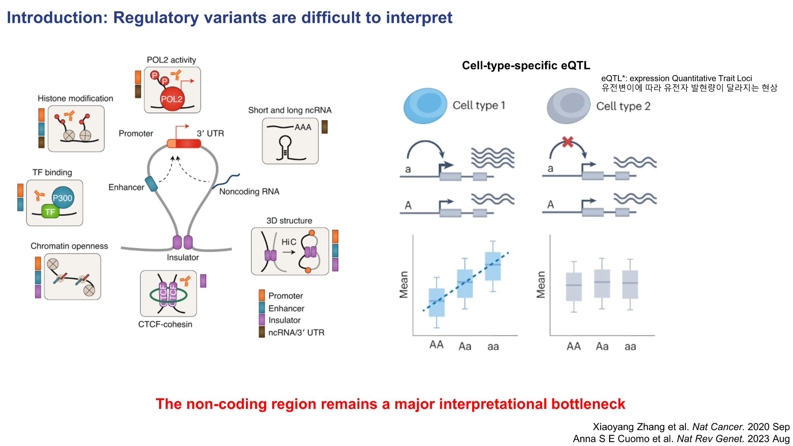
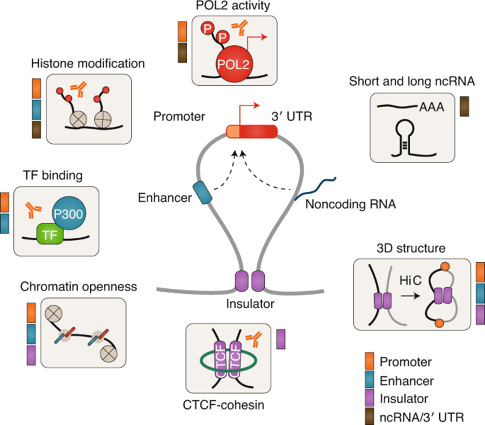
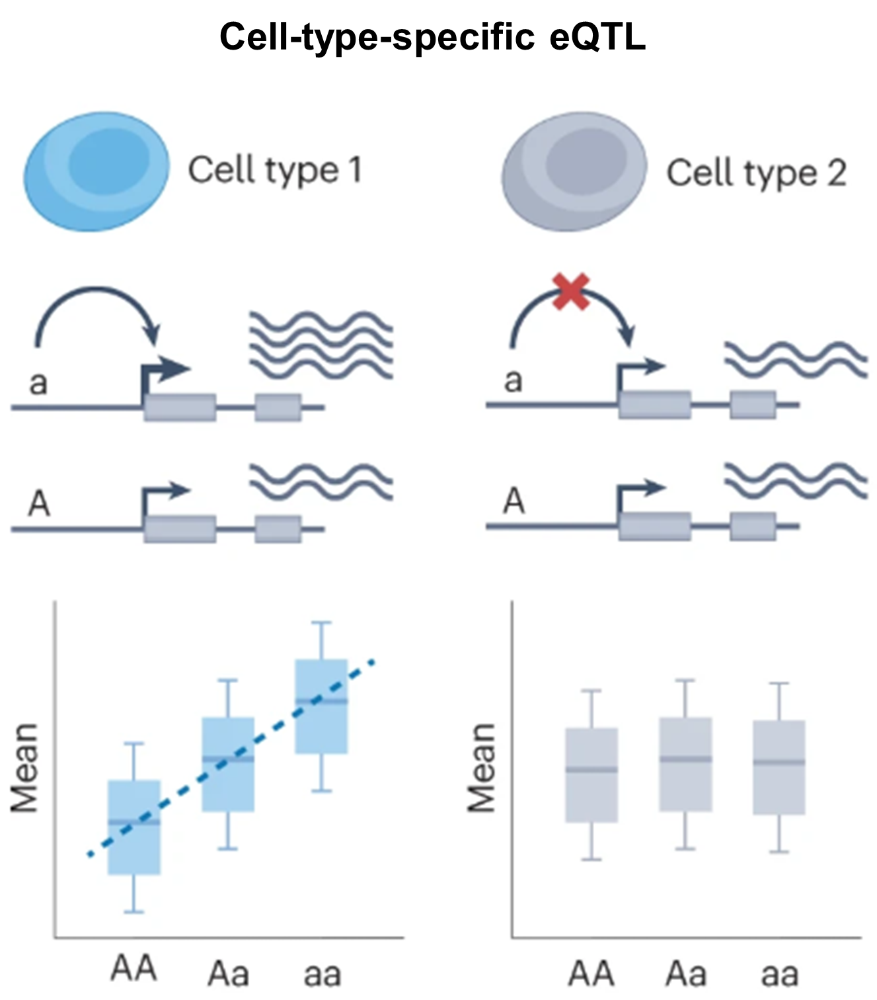

# 1. Regulatory variants are difficult to interpret

<!-- { .figure-wide } -->

먼저 **regulatory variant**는 유전자 발현 조절 과정에 영향을 주는 변이를 의미합니다.  
이런 변이의 상당수는 protein-coding exon이 아니라 **non-coding 영역**에 존재합니다.  
문제는 이 non-coding DNA가 단순한 “빈 공간”이 아니라, 실제로는 유전자 발현을 조절하는 다양한 요소들로 이루어져 있다는 점입니다.

{ .figure-medium }

이 그림의 중심에는 하나의 유전자 조절 단위가 요약되어 있습니다. 가운데의 **promoter**는 실제 전사가 시작되는 위치이고, 옆의 **enhancer**는 떨어져 있는 위치에서도 promoter의 활성을 높일 수 있는 조절 요소입니다. 또 아래의 **insulator**는 모든 enhancer가 임의의 promoter를 조절하지 못하도록 경계를 만들어 주는 역할을 하며, 이 과정에는 **CTCF–cohesin** 같은 구조 단백질이 관여해 크로마틴의 접힘과 상호작용 범위를 제한합니다.

동시에 non-coding 영역에서는 여러 분자적 신호가 함께 작동합니다. 예를 들어 어떤 DNA 서열에 **transcription factor**가 결합하면, 그 자체로 끝나는 것이 아니라 주변의 **chromatin accessibility**를 바꾸고, **histone modification** 패턴을 변화시키며, 더 나아가 **RNA polymerase II activity**나 전사 개시 효율에도 영향을 줄 수 있습니다. 즉, 하나의 변이가 TF binding motif를 약화시키거나 새롭게 만들면, 그 효과는 단일 결합 자리의 변화에 머무르지 않고 chromatin state와 transcriptional output 전체로 확장될 수 있습니다.

또한 이 그림은 조절이 선형적인 DNA 상에서만 일어나는 것이 아니라 **3차원 게놈 구조** 안에서 일어난다는 점도 강조합니다. Enhancer와 promoter는 염기서열 상으로는 멀리 떨어져 있어도, 크로마틴이 loop를 형성하면 물리적으로 가까워질 수 있습니다.  
따라서 어떤 변이는 enhancer 자체를 바꿀 수도 있고, CTCF/cohesin-mediated boundary를 교란해서 원래 만나지 않던 조절 요소들이 새롭게 접촉하게 만들 수도 있습니다.

여기에 더해, non-coding 영역은 단지 전사 시작만 조절하는 것이 아니라 **short/long ncRNA**, **3′ UTR processing**, 그리고 mRNA 안정성처럼 전사 이후 단계와 연결된 조절에도 관여할 수 있습니다. 즉, 같은 non-coding variant라도 어떤 위치에 있느냐에 따라 전사 개시, enhancer 활성, chromatin opening, 구조적 상호작용, RNA processing 등 서로 다른 층위의 기능적 결과를 만들 수 있습니다.

정리하면, non-coding 영역의 regulatory variant는 단순히 “한 염기가 바뀌었다”는 수준이 아니라 **TF binding, chromatin accessibility, histone marks, 3D genome architecture, RNA-related regulation**이 서로 얽혀 있는 조절 네트워크를 교란할 수 있습니다.  
그래서 non-coding variant의 기능을 해석하는 일은 여전히 어렵고, 이 복잡한 조절 층위를 함께 다룰 수 있는 모델이 필요하게 됩니다.

## 같은 variant라도 세포 유형에 따라 효과가 달라질 수 있다

{ .figure-small }

다음 그림은 **cell-type-specific eQTL**의 개념을 단순화해서 보여줍니다.  
여기서 eQTL (expression quantitative trait locus) 은 특정 유전변이가 유전자 발현량의 차이와 통계적으로 연관되는 경우를 의미합니다.  
즉, 어떤 위치의 염기가 달라졌을 때 그 변이를 가진 사람들에서 특정 유전자의 발현량이 높아지거나 낮아지는 현상을 말합니다.

QTL이라는 개념은 뒤에서도 자주 등장하므로, 여기서 한 번 익숙해지고 넘어가면 이후 내용을 읽기가 더 수월합니다. 
핵심: 특정 유전변이가 어떤 분자적 형질의 차이와 통계적으로 연관되는 것. 
예1) <b>eQTL</b>: 유전자 <b>발현량(expression level)</b>의 차이와 연관된 변이 
예2) <b>sQTL</b>: 유전자의 <b>splicing pattern</b> 차이와 연관된 변이 
예3) <b>caQTL</b>: <b>chromatin accessibility</b> 차이와 연관된 변이

그림에서 대문자 **A** 와 소문자 **a** 는 같은 유전체 위치에 존재할 수 있는 두 대립유전자(allele)를 뜻합니다. 그리고 아래의 **AA, Aa, aa** 는 각각 두 개의 염색체에 어떤 allele 조합을 가지고 있는지를 나타내는 유전자형(genotype)입니다. 즉, AA는 A allele을 두 개 가진 경우, Aa는 서로 다른 allele을 하나씩 가진 경우, aa는 a allele을 두 개 가진 경우입니다.

왼쪽의 **cell type 1**에서는 a allele이 있는 경우 전사가 더 잘 일어나는 방향으로 작용하고 있습니다. 그 결과 아래 boxplot을 보면 **AA → Aa → aa** 로 갈수록 평균 발현량이 점진적으로 증가합니다. 즉, 이 세포에서는 해당 variant가 실제로 유전자 발현을 조절하는 기능적 효과를 갖고 있고, 그 효과가 allele dosage, 다시 말해 a allele의 개수에 비례해서 나타나는 것입니다.

반면 오른쪽의 **cell type 2**에서는 같은 위치의 변이가 있어도 발현량 차이가 거의 나타나지 않습니다. 위의 도식에서 붉은 X 표시는 이 세포에서는 해당 조절 작용이 일어나지 않음을 의미하고, 아래 boxplot 역시 AA, Aa, aa 세 유전자형 사이에 뚜렷한 차이가 보이지 않습니다. 즉, 같은 variant라도 어떤 세포에서는 기능적이지만, 다른 세포에서는 거의 중립적으로 보일 수 있다는 뜻입니다.

이런 차이가 발생하는 핵심 이유는 **각 세포 유형이 서로 다른 regulatory landscape를 가지고 있기 때문**입니다. 같은 DNA 서열을 공유하더라도, 세포마다 발현되는 transcription factor가 다르고, chromatin accessibility, histone modification, enhancer 사용 여부, 그리고 enhancer와 promoter가 실제로 접촉하는 3차원 구조도 서로 다를 수 있습니다.

예를 들어 어떤 variant가 특정 transcription factor의 결합 모티프를 강화한다고 가정해보겠습니다. 그 transcription factor가 **cell type 1**에서는 실제로 발현되고 있고, 또 그 주변 chromatin이 열려 있으며, 해당 enhancer가 target promoter와 접촉하고 있다면 그 변이는 실제 발현 변화를 일으킬 수 있습니다. 이 경우에는 a allele이 더 강한 결합을 만들고, 그 결과 aa genotype에서 발현이 가장 높게 나타날 수 있습니다.

하지만 **cell type 2**에서는 상황이 다를 수 있습니다. 같은 서열 변화가 있어도 그 transcription factor 자체가 그 세포에 존재하지 않거나, 주변 chromatin이 닫혀 있어 DNA에 접근할 수 없거나, 혹은 해당 enhancer가 그 세포에서는 아예 사용되지 않을 수 있습니다. 또는 구조적으로 promoter와 연결되지 않아 downstream transcription에 영향을 주지 못할 수도 있습니다. 이런 경우에는 서열상으로는 같은 variant라도 실제 발현 차이는 거의 나타나지 않게 됩니다.

즉, eQTL effect는 “변이 자체의 고정된 속성”이라기보다 **특정 세포 환경 안에서 그 변이가 얼마나 실제 조절 회로에 연결되느냐** 에 의해 결정된다고 볼 수 있습니다. 이 점 때문에 non-coding variant interpretation은 단순히 DNA 서열만 보는 것으로 충분하지 않고, 세포 유형별 chromatin state와 regulatory context를 함께 고려해야 하는 어려운 문제가 됩니다.

정리하면, 이 그림은 같은 유전변이라도 어떤 세포에서는 실제 eQTL로 작동하고, 다른 세포에서는 거의 아무 효과도 보이지 않을 수 있음을 보여줍니다. 즉, **variant effect is context-dependent and cell-type-specific** 하다는 점이 non-coding variant 해석의 핵심 어려움 중 하나입니다.

<strong>Takeaway.</strong> 
Regulatory variant는 다양한 조절 기전을 통해 작용하고, 그 효과도 세포 유형 특이적으로 나타날 수 있기 때문에 
non-coding 영역의 variant interpretation은 여전히 중요한 해석상의 bottleneck으로 남아 있습니다.

## Reference

[1] Zhang X, Meyerson M. *Illuminating the noncoding genome in cancer*. **Nature Cancer**. 2020;1(9):864-872.

[2] Cuomo ASE, Nathan A, Raychaudhuri S, MacArthur DG, Powell JE. *Single-cell genomics meets human genetics*. **Nature Reviews Genetics**. 2023;24(8):535-549.
