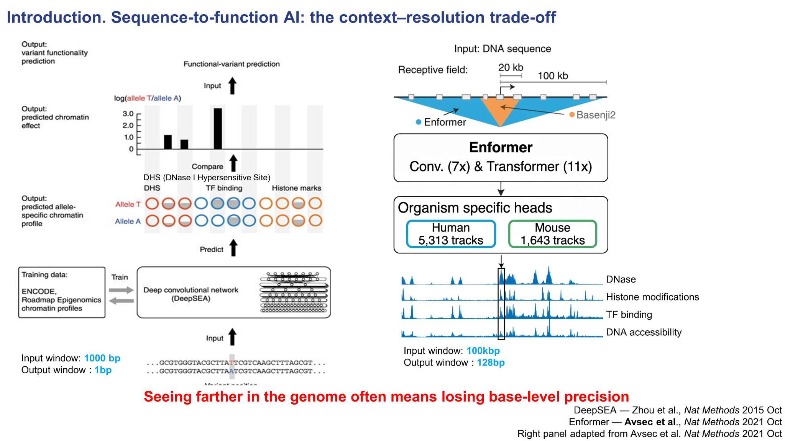
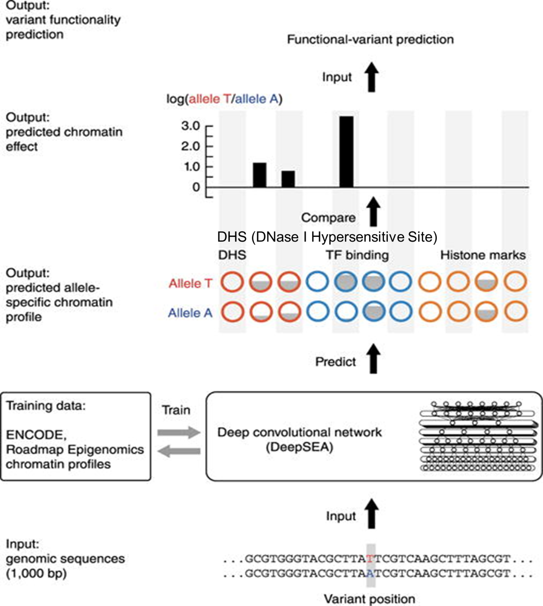
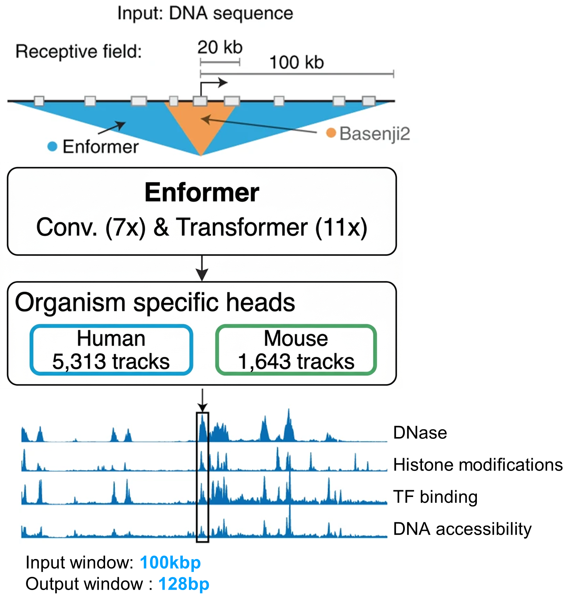

# 2. Sequence-to-function AI: context–resolution trade-off

{ .figure-wide }

Introduction slide 2. Sequence-to-function AI에서 context–resolution trade-off를 설명하는 슬라이드입니다.

## Sequence-to-function AI는 무엇을 하는가

이러한 어려움을 해결하기 위해 등장한 것이 **sequence-to-function AI** 모델입니다.  
이 계열의 모델은 DNA 서열을 입력으로 받아 chromatin accessibility, TF binding, histone mark 같은 기능적 출력을 예측하고,  
reference allele과 alternative allele 사이의 예측 차이를 비교해서 **variant effect**를 추정합니다.

## 짧은 입력은 정밀하지만, 긴 문맥을 보기 어렵다

{ .figure-medium }

DeepSEA처럼 짧은 입력 window를 쓰는 모델은 single-base 수준의 비교에 강합니다.

예를 들어 DeepSEA는 약 **1000 bp** 정도의 비교적 짧은 DNA 서열을 입력으로 사용합니다.  
이런 구조는 국소적인 motif 변화나 주변의 짧은 문맥에서 발생하는 효과를 정밀하게 포착하는 데에는 강점이 있습니다.

하지만 1000 bp 정도의 입력 길이는 single-base 수준의 예측에는 적합해도,  
더 멀리 떨어진 enhancer–promoter interaction이나 장거리 genomic context를 충분히 반영하기에는 짧습니다.

## 긴 입력은 장거리 정보를 보지만, 해상도는 낮아질 수 있다

{ .figure-small }

Enformer처럼 긴 입력을 보는 모델은 더 멀리까지 보지만, 출력이 보통 bin 단위입니다.

그래서 이후 모델들은 더 긴 genomic context를 보기 위해 입력 길이를 **100 kb 수준**까지 확장했습니다.  
하지만 이런 모델들은 출력이 **128 bp bin** 단위로 주어지는 경우가 많아서,  
특정 염기 하나의 세밀한 변화보다는 주변 구간의 평균적인 정보를 보게 됩니다.

즉, 긴 문맥을 볼 수 있게 되면서 context는 늘어났지만, 반대로 **single-base 수준의 resolution은 떨어질 수 있습니다.**  
이것이 sequence-to-function AI에서 중요한 **context–resolution trade-off**입니다.

**Takeaway.**  
짧은 모델은 정밀도에, 긴 모델은 문맥에 강합니다.  
AlphaGenome은 바로 이 trade-off를 어떻게 줄일 수 있을지에서 출발하는 모델이라고 볼 수 있습니다.

