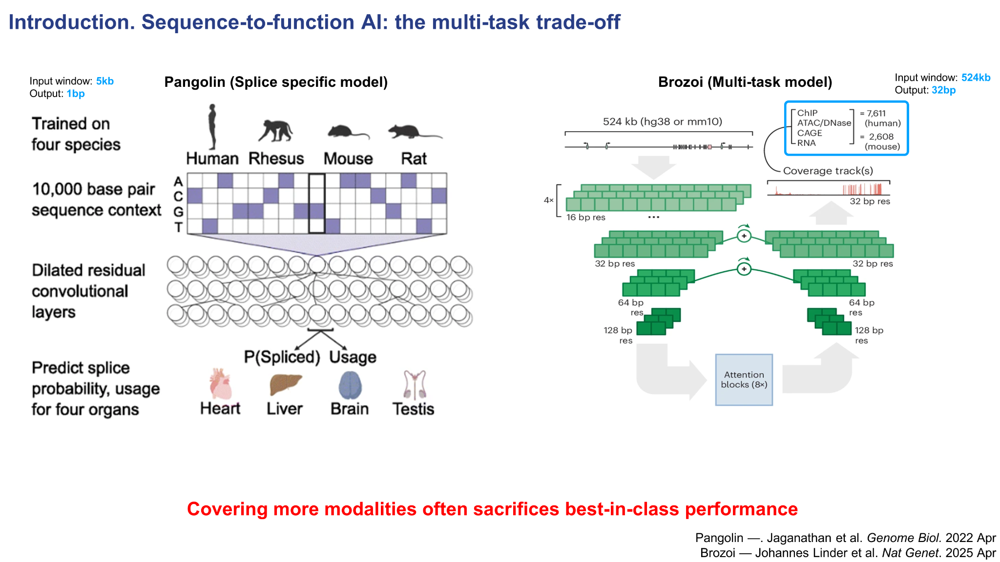
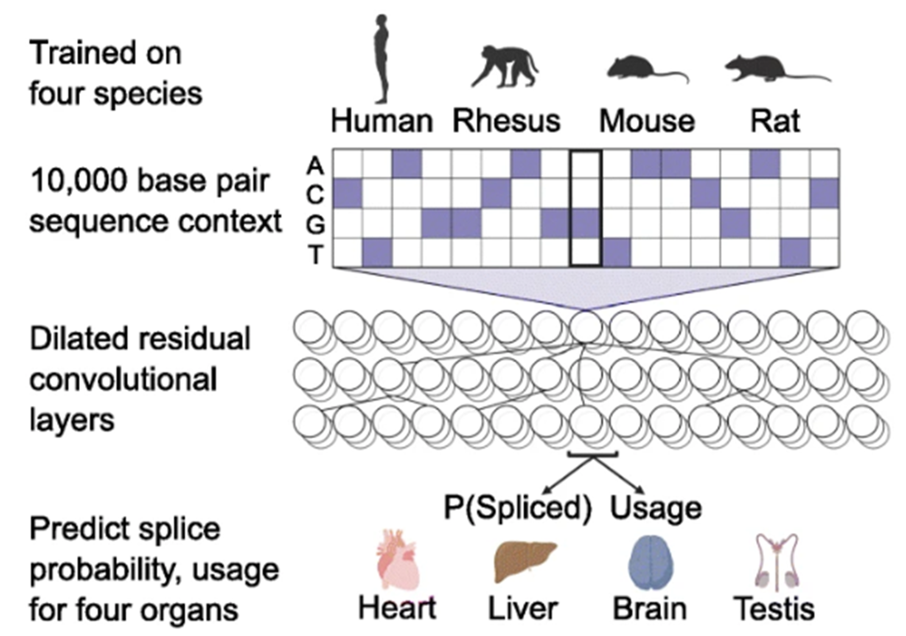
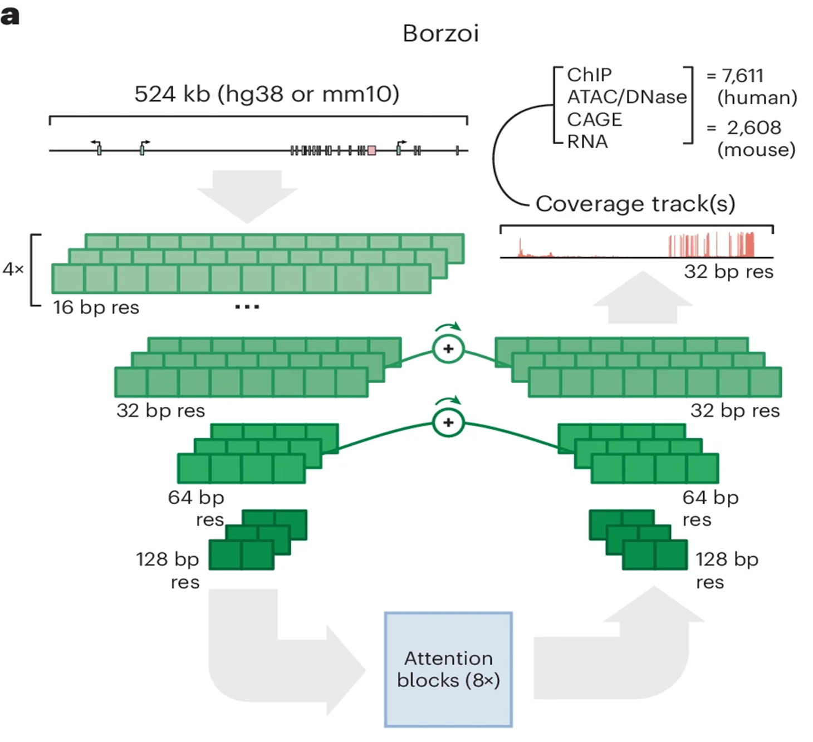

# 3. Sequence-to-function AI: multi-task trade-off

{ .figure-wide }

Introduction slide 3. Specialist model과 multi-task generalist model 사이의 trade-off를 설명합니다.

## Specialist와 generalist의 차이

기존 sequence-to-function AI 모델들은 크게 보면  
특정 task에 특화된 **task-specific model**과, 여러 modality를 함께 다루는 **multi-task model**로 나눌 수 있습니다.

### Pangolin: splicing에 특화된 specialist

{ .figure-small }

Pangolin은 splicing 중심의 specialist model입니다.

왼쪽의 Pangolin은 대표적인 task-specific model입니다.  
약 10,000 bp 정도의 입력 서열을 바탕으로, 각 염기 위치가 splice donor site인지 splice acceptor site인지를  
single-base 수준에서 예측합니다.  
즉, splicing이라는 특정 task에 매우 특화되어 있고, 그만큼 높은 해상도와 높은 정확도를 목표로 합니다.

### Borzoi: 더 긴 문맥과 더 많은 modality를 다루는 generalist

{ .figure-small }

Borzoi는 더 긴 입력 문맥과 더 다양한 functional output을 다루는 generalist에 가깝습니다.

반면 오른쪽의 Borzoi는 더 긴 입력 문맥을 보고, 더 다양한 functional output을 함께 예측하는 multi-task 모델입니다.  
입력 길이는 약 **524 kb**로 훨씬 길지만, 출력은 **32 bp bin** 단위로 주어지기 때문에 해상도는 상대적으로 낮습니다.

또 이렇게 여러 modality를 함께 다루는 generalist model은 적용 범위는 넓지만,  
특정 task에서는 specialist model보다 성능이 떨어질 수 있습니다.  
실제로 splicing prediction에서는 SpliceAI나 Pangolin 같은 전용 모델이 여전히 더 강한 benchmark가 존재합니다.

**Takeaway.**  
여러 modality를 폭넓게 다룰수록 범용성은 높아지지만,  
특정 task의 정밀도와 정확도는 오히려 희생될 수 있습니다.  
AlphaGenome은 generalist model이면서도 이런 약점을 줄이려는 시도를 보여줍니다.

