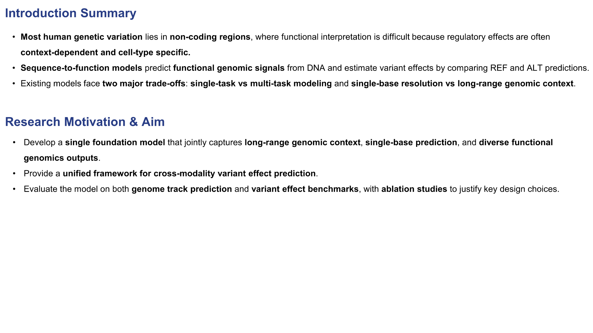

# Introduction summary

Introduction · Slide 4

{ .slide-image }

Intro summary. The problem is hard, existing models face two trade-offs, and AlphaGenome aims to unify long context, base resolution, and diverse outputs.

## 요약 문장

### Introduction summary

- 대부분의 human genetic variation은 **non-coding region**에 존재하며,
  이 영역의 functional interpretation은 **regulatory complexity**와 **cell-type specificity** 때문에 어렵습니다.
- sequence-to-function model은 DNA로부터 functional genomic output을 예측하고,
  REF–ALT 차이를 통해 variant effect를 추정할 수 있습니다.
- 그러나 기존 모델은 두 가지 큰 trade-off를 안고 있었습니다.
  - **single-base resolution vs long-range genomic context**
  - **task-specific specialization vs multi-task coverage**

## Research motivation & aim

-   __Aim 1__

    ---

    long-range genomic context와 single-base prediction을 동시에 다룰 수 있는
    **single foundation model**을 지향합니다.

-   __Aim 2__

    ---

    chromatin, TF binding, histone marks, splicing, expression 등 다양한 output을
    한 프레임워크 안에서 연결합니다.

-   __Aim 3__

    ---

    genome track prediction뿐 아니라 variant effect benchmark에서도
    모델 설계의 타당성을 보여주는 것을 목표로 합니다.

## 발표용 정리 멘트

이 introduction의 핵심은 세 가지입니다.

첫째, 해석이 어려운 변이의 대부분은 non-coding 영역에 있고 그 효과는 context-dependent합니다.  
둘째, 기존 sequence-to-function 모델들은 **context와 resolution**, **specialist와 generalist** 사이의 trade-off를 안고 있었습니다.  
셋째, AlphaGenome은 이 두 trade-off를 동시에 완화하는 하나의 foundation model을 지향합니다.

## 다음 페이지로 연결할 때

- Paper overview로 넘어가면서 **“그래서 AlphaGenome은 무엇을 입력으로 받고 무엇을 예측하는가?”** 로 이어가면 자연스럽습니다.
- 또는 Figure 1로 바로 넘어가 **모델 아키텍처와 output space**를 소개해도 됩니다.

  <a href="../03-multitask-tradeoff/">← Previous: multi-task trade-off</a>
  <a href="../../paper/overview/">Next: paper overview →</a>

